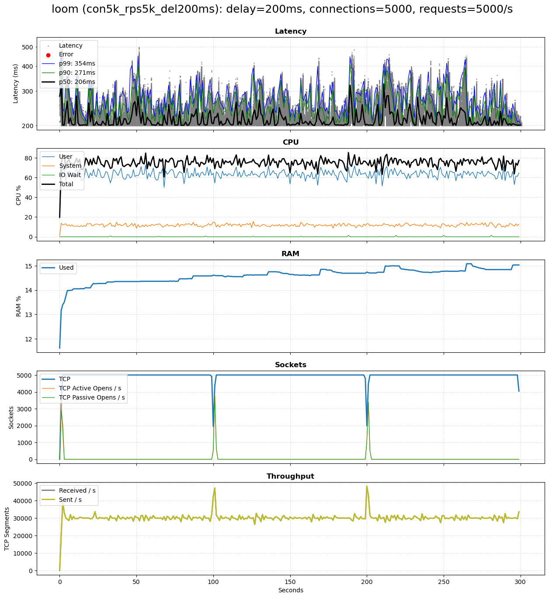
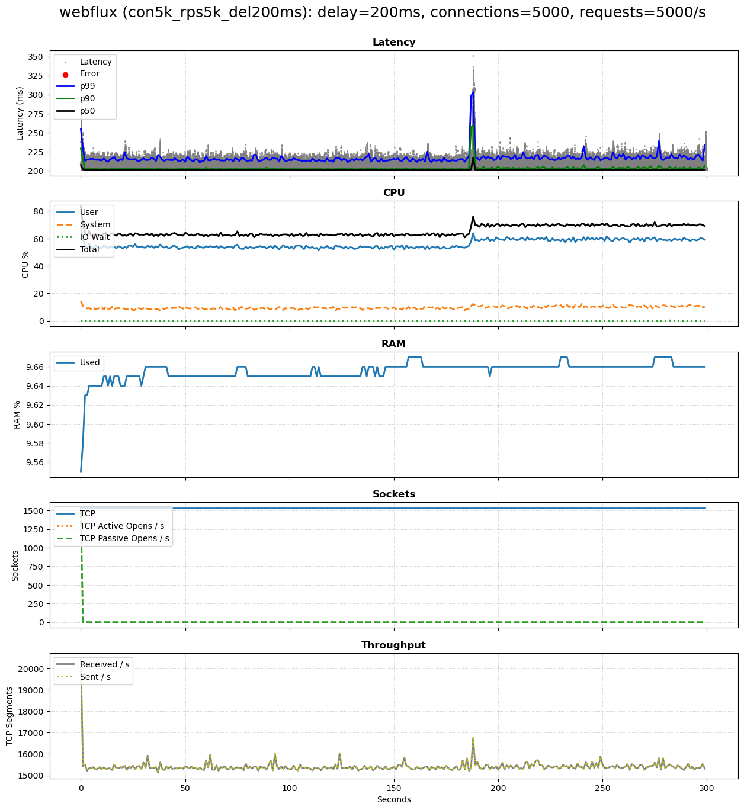
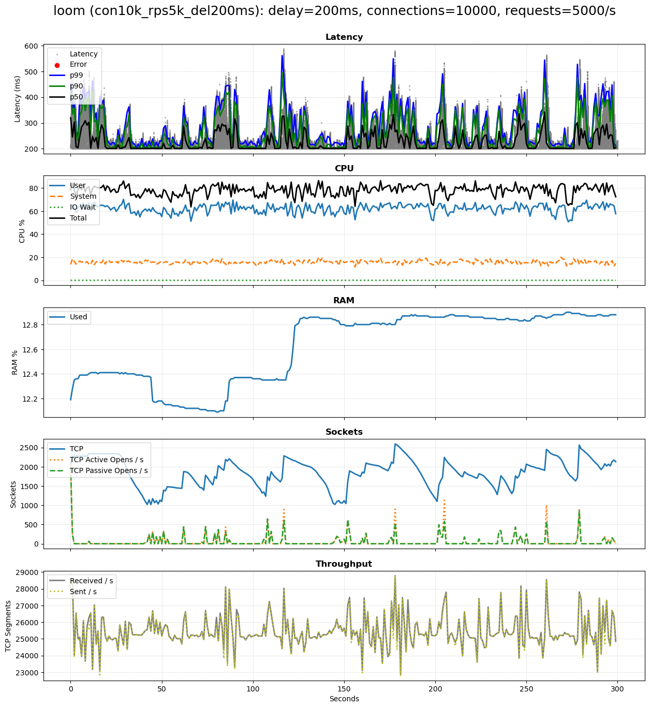
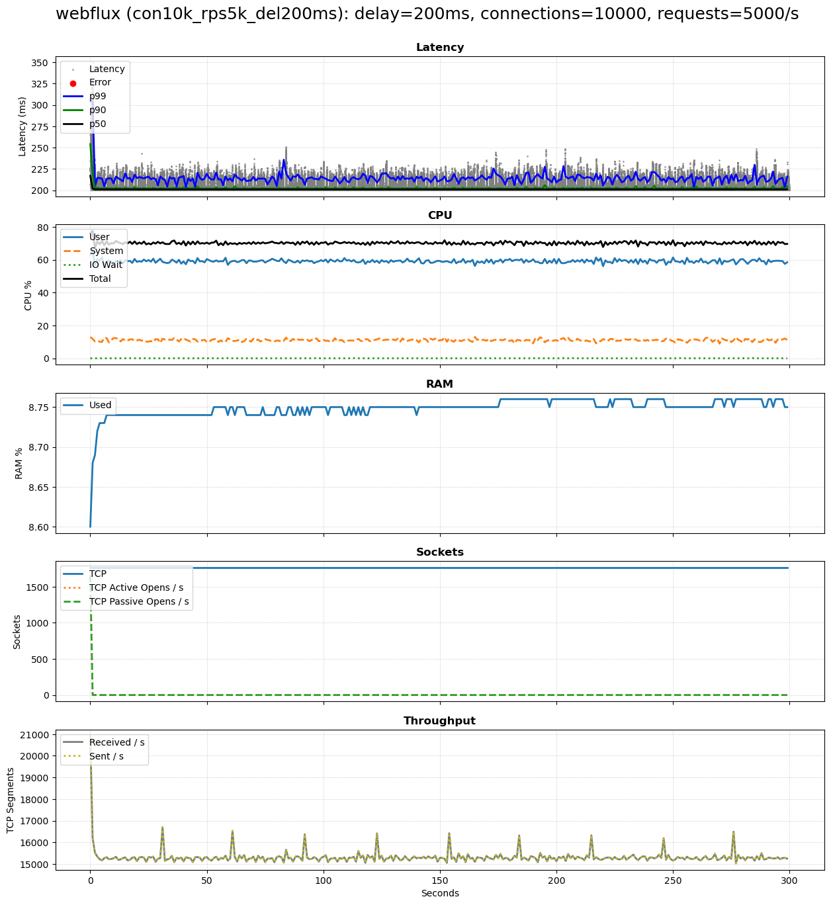

# Benchmark of Java Virtual Threads vs WebFlux

This Java 21 project benchmarks a simple [Spring Boot 3.2.4](https://spring.io/projects/spring-boot) HTTP endpoint using configurable scenarios, comparing Java Virtual Threads (introduced by [Project Loom, JEP 444](https://openjdk.org/jeps/444)) with [Spring WebFlux](https://docs.spring.io/spring-framework/reference/web/webflux.html) (relying on [Project Reactor](https://projectreactor.io/)).

### Background

Both Spring WebFlux and Virtual Threads are alternative technologies to create Java microservices that support a high number of concurrent users, mapping all incoming requests to very few shared operating system threads. This reduces the resource overhead incurred by dedicating a single operating system thread to each user.

Spring WebFlux was first introduced in September 2017. Virtual Threads were first introduced as preview feature with Java 19 and were fully rolled out with Java 21 in September 2023.

### Features

* Fully automated and CLI-driven via `benchmark-all.sh`. 
* Test scenario support, see `test-scenario.csv`.
* Produces single PNG plot using [Matplotlib](https://matplotlib.org/) for each scenario and approach (Loom or WebFlux), containing:
  * Raw latencies and P50/90/99 percentiles, as well as any errors
  * System metrics for CPU, RAM, sockets, and network throughput

### Design
* The benchmark is driven by [vegeta](https://github.com/tsenart/vegeta) which repeatedly issues HTTP GET requests to a service listening at http://localhost:8080/epoch-millis/$approach?delayInMillis=$delayInMillis
* The service implementation consists of two steps:
  1. It waits `$delayInMillis` (default: `100`) to mimic a network call, filesystem wait, or similar. Whilst the request waits, its operating system thread can be reused by another request. Both Loom and WebFlux use their respective idiomatic ways to wait. 
  2. It then returns the milliseconds since the epoch.

### Requirements
* Unix-based OS; tested with Ubuntu 22.04
* [vegeta](https://github.com/tsenart/vegeta) to create load and measure latency
* [sar/sadf](https://linux.die.net/man/1/sar) to measure system resource use
* Python 3 and [Matplotlib](https://matplotlib.org/) to convert latency and system CSV measurements into a PNG image

## Setup 

The following instructions assume you are using a Debian-based Linux such as Ubuntu 22.04. 

### vegeta

[vegeta](https://github.com/tsenart/vegeta) is used to load the service. Here's how to build it:

```shell
git clone https://github.com/tsenart/vegeta
cd vegeta
make vegeta
mv vegeta ~/bin
```

Make sure that the `vegeta` executable is in your `$PATH`.

### Python 3, matplotlib, sar and sadf

Python 3 and `matplotlib` are used to convert the CSV output of `vegeta` and `sar`/`sadf` to a single PNG chart. The `sar` and `sadf` tools come as part of `sysstat` and are used to measure resource use.

To install these, run:

```shell
sudo apt update && sudo apt install -y python3 python3-matplotlib sysstat
```

### Increase Open File Limit

The following is needed to ensure your system can handle a large number of concurrent connections:

```shell
printf '* soft nofile 1048576\n* hard nofile 1048576\n' | sudo tee -a /etc/security/limits.conf 
```

Then log out and back in.


## Benchmark 

The following command runs the benchmark for all scenarios in `test-scenarios.csv`, first for Project Loom, then for WebFlux, and records its output in the `results` folder:

```shell
./benchmark-all.sh 
```

The benchmark run for each scenario consists of the following steps:
* Build and start Spring Boot service with chosen approach (Loom or WebFlux).
* Run two iterations of the benchmark. The result of each iteration is copied to the `results` folder, where each new iteration overwrites the previous one.
* Stop the service.

## Config

Configuration of the benchmark:
* Scenarios: `test-scenarios.csv` containing one scenario per line.
* Service: `build-*.gradle` configures the heap space to 1 GiB.

## Results

The following charts show interesting findings. 

Each chart charts show the client-side end-to-end request latencies (Y axis, in ms) over elapsed benchmark time (X axis, in seconds), as well as resource use.

All charts for a run on the test machine (see below for specs) can be found in the `results` folder of this GitHub repo,
including the benchmark log output to `stdout`.

### Scenario: 5k connections, 5k requests / s, request delay 200ms

This simulates 5000 concurrent users, each issuing one request per second. Each request waits 200ms for another resource such as a down-stream service or DB.

#### Virtual Threads



#### WebFlux



### Scenario: 10k connections, 5k requests / s, request delay 200ms

Same as before, but with 10,000 concurrent users, each issuing one request every two seconds.

#### Virtual Threads



#### WebFlux



## Known Issues 

- vegeta cannot be forced to use a specific number of connections. Instead, you can only specify a desired and maximum number. This explains why in several scenarios, including those referenced in this README, the number of TCP sockets is lower than the number of desired connections. 

## Test Environment

The benchmark was performed on the following physical machine:

```
Java:   OpenJDK 64-Bit Server VM Corretto-21.0.2.13.1 (build 21.0.2+13-LTS, mixed mode, sharing)
OS:     PRETTY_NAME="Ubuntu 22.04.4 LTS"
Kernel: 5.15.86-051586-generic
CPU:    Model name:                      Intel(R) Core(TM) i7-6700K CPU @ 4.00GHz
Cores:  8
```

This output was obtained via:

```shell
printf "Java:\t" && java --version | grep "Server" && printf "OS:\t" && cat /etc/os-release | grep "PRETTY" && printf "Kernel:\t" && uname -r && printf "CPU:\t" && lscpu | grep "Model name" && printf "Cores:\t" && cat /proc/cpuinfo | awk '/^processor/{print $3}' | wc -l
```

The system was rebooted before each test and quieted down as much as possible. The baseline CPU use before test start was ca. 3%.
