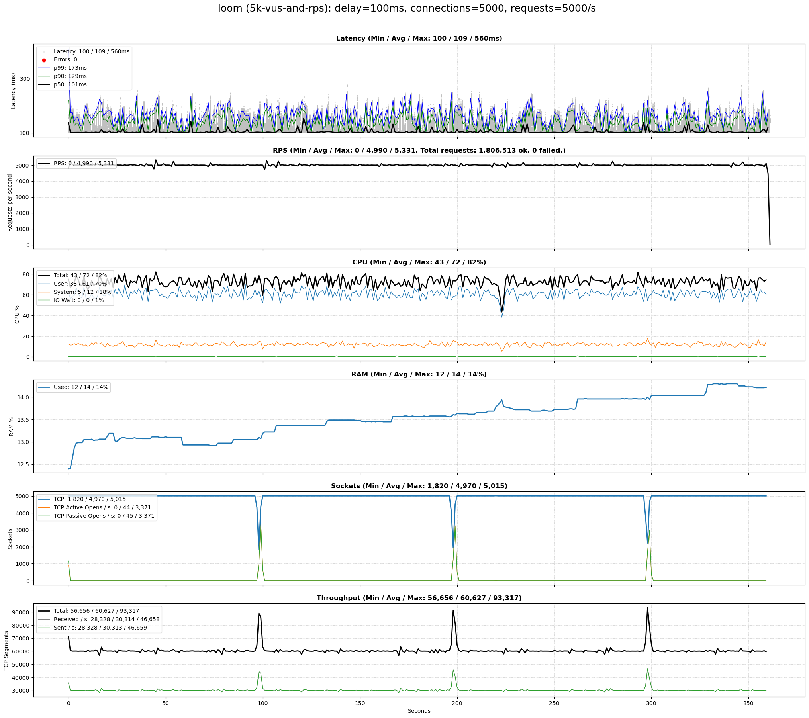
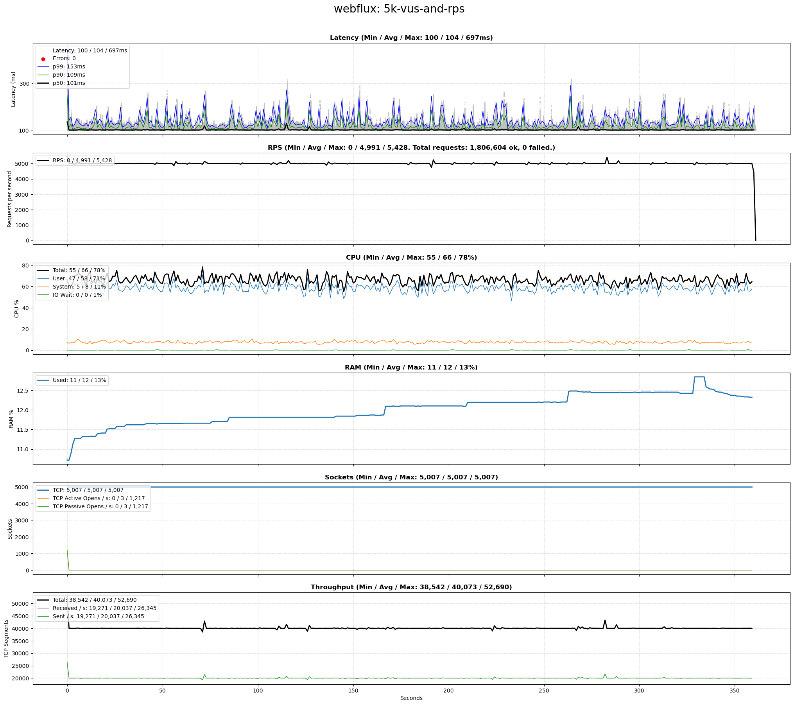
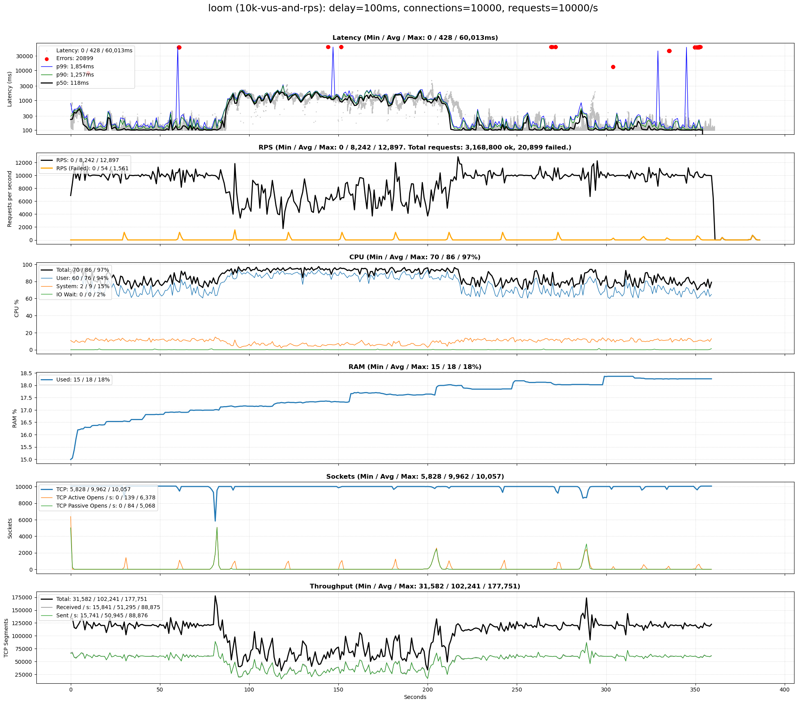
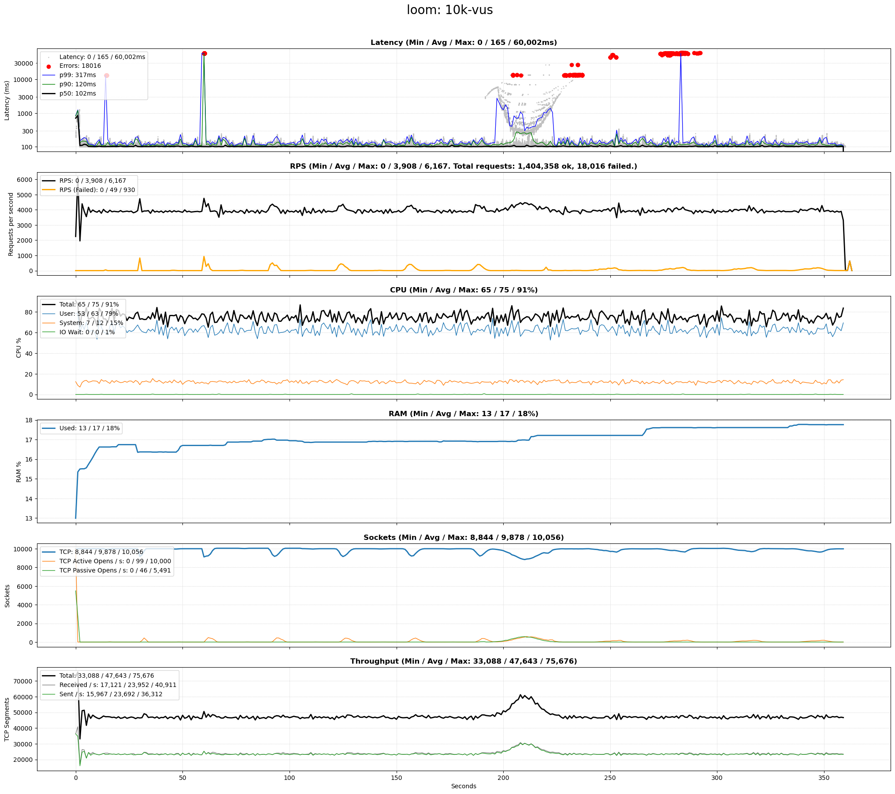
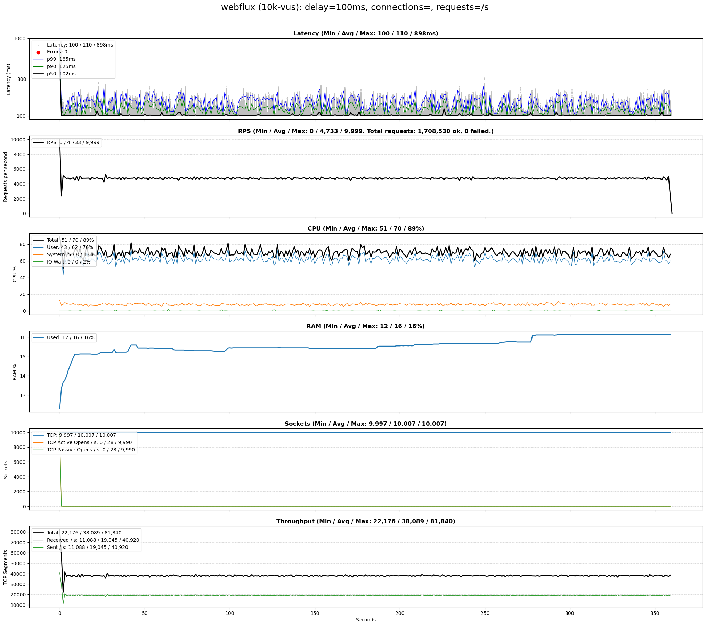
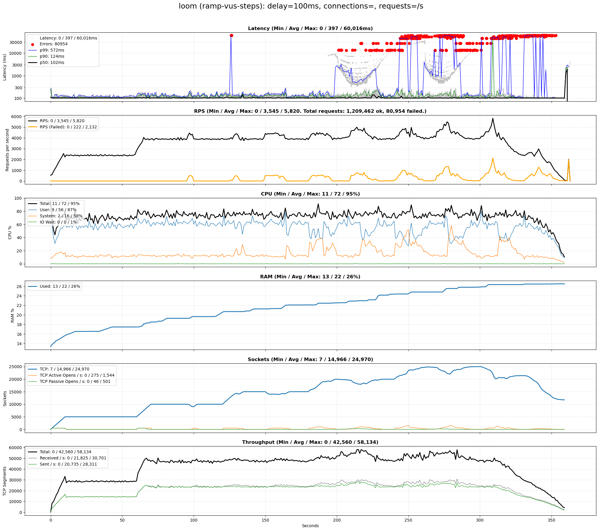
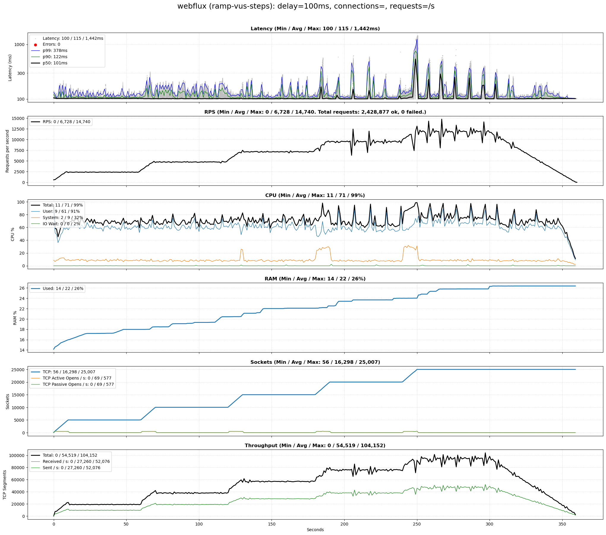
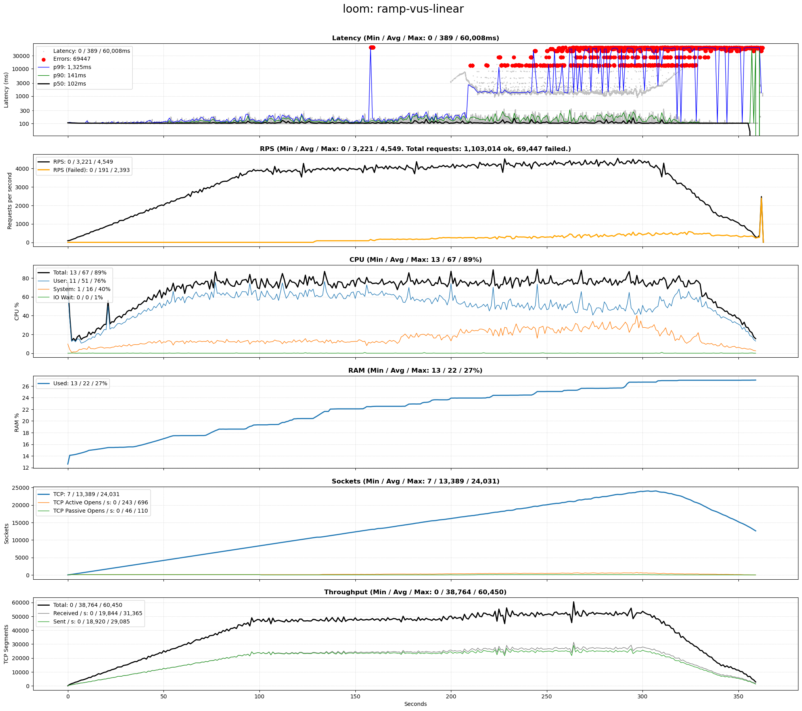
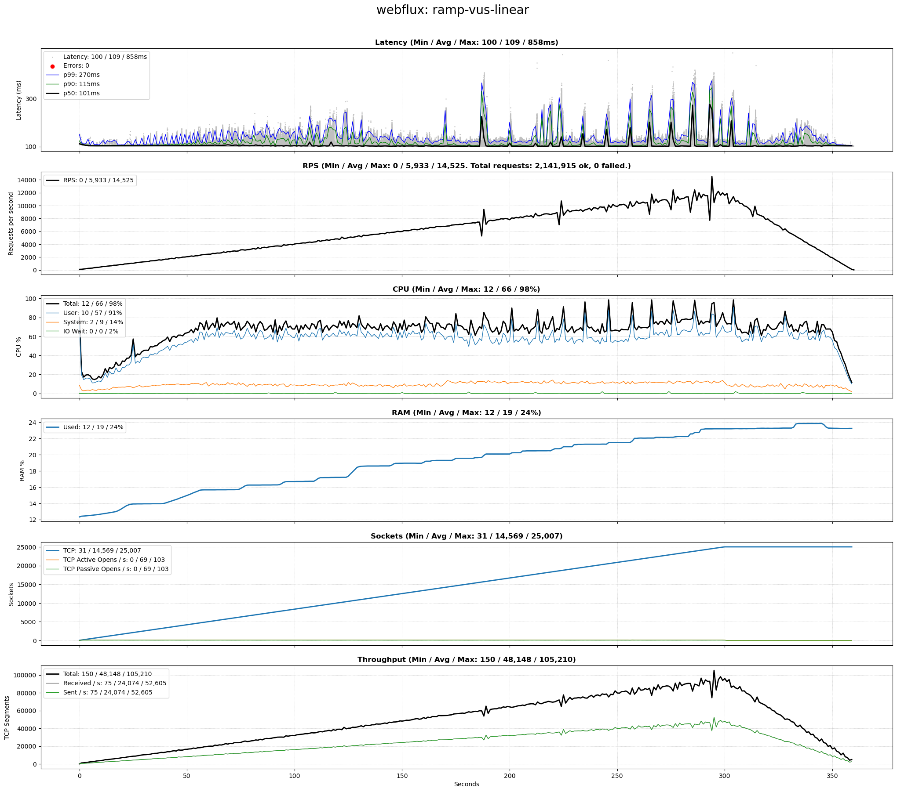

# Benchmark of Java Virtual Threads vs WebFlux

This Java 21 project benchmarks a simple [Spring Boot 3.2.4](https://spring.io/projects/spring-boot) HTTP endpoint using configurable scenarios, comparing Java Virtual Threads (introduced by [Project Loom, JEP 444](https://openjdk.org/jeps/444)) with [Spring WebFlux](https://docs.spring.io/spring-framework/reference/web/webflux.html) (relying on [Project Reactor](https://projectreactor.io/)).

### Background

Both Spring WebFlux and Virtual Threads are alternative technologies to create Java microservices that support a high number of concurrent users, mapping all incoming requests to very few shared operating system threads. This reduces the resource overhead incurred by dedicating a single operating system thread to each user.

Spring WebFlux was first introduced in September 2017. Virtual Threads were first introduced as preview feature with Java 19 and were fully rolled out with Java 21 in September 2023.

### Features

* Fully automated and CLI-driven via `benchmark-all.sh`. 
* Test scenario support, see `test-scenario.csv`.
* Produces single PNG plot using [Matplotlib](https://matplotlib.org/) for each scenario and approach (Loom or WebFlux), containing:
  * Raw latencies and P50/90/99 percentiles, as well as any errors
  * System metrics for CPU, RAM, sockets, and network throughput

### Design
* The benchmark is driven by [k6](https://k6.io/docs/) which repeatedly issues HTTP GET requests to a service listening at http://localhost:8080/epoch-millis/$approach?delayInMillis=$delayInMillis
* The service implementation consists of two steps:
  1. It waits `$delayInMillis` (default: `100`) to mimic a network call, filesystem wait, or similar. Whilst the request waits, its operating system thread can be reused by another request. Both Loom and WebFlux use their respective idiomatic ways to wait. 
  2. It then returns the milliseconds since the epoch.

## Requirements

### Software Requirements
* Unix-based OS; tested with Ubuntu 22.04
* Java 21 or above
* [k6](https://k6.io/docs/) and Python 3 with [Matplotlib](https://matplotlib.org/) to drive load and measure latency
* [sar/sadf](https://linux.die.net/man/1/sar) to measure system resource use
* Python 3 and [Matplotlib](https://matplotlib.org/) to convert latency and system CSV measurements into a PNG image

### Hardware Requirements

The hardware requirements depend purely on the scenarios configured in `config/scenarios.csv`. The following is recommended to run the default scenarios committed to this repo:
* CPU comparable to Intel 6700K or above
* 16 GiB RAM

## Setup 

The following instructions assume you are using a Debian-based Linux such as Ubuntu 22.04. 

### Java 21

You'll need Java 21 or above:

```shell
sudo apt install openjdk-21-jdk
```

### k6

[k6](https://k6.io/docs/) is used to load the service:

```shell
sudo gpg -k
sudo gpg --no-default-keyring --keyring /usr/share/keyrings/k6-archive-keyring.gpg --keyserver hkp://keyserver.ubuntu.com:80 --recv-keys C5AD17C747E3415A3642D57D77C6C491D6AC1D69
echo "deb [signed-by=/usr/share/keyrings/k6-archive-keyring.gpg] https://dl.k6.io/deb stable main" | sudo tee /etc/apt/sources.list.d/k6.list
sudo apt-get update
sudo apt-get install k6
```

### Python 3, matplotlib, sar and sadf

Python 3 and `matplotlib` are used to convert the CSV output of `k6` and `sar`/`sadf` to a single PNG chart. The `sar` and `sadf` tools come as part of `sysstat` and are used to measure resource use. To install them run:

```shell
sudo apt update && sudo apt install -y python3 python3-matplotlib sysstat
```

### Linux Optimizations

The following adjustments optimize Linux for HTTP load tests. 

#### Increase Open File Limit

Ensure your system can handle a large number of concurrent connections:

```shell
printf '* soft nofile 1048576\n* hard nofile 1048576\n' | sudo tee -a /etc/security/limits.conf 
```

#### Allow Fast Connection Reuse

Ensure the TCP connections created by a test scenario can be quickly reused by subsequent scenarios:

```shell
printf 'net.ipv4.tcp_tw_reuse = 1\nnet.ipv4.tcp_tw_recycle = 1\n' | sudo tee -a /etc/sysctl.conf
```

Please note that the latter adjustment (`net.ipv4.tcp_tw_recycle = 1`) is [known](https://www.speedguide.net/articles/linux-tweaking-121) to cause problems if your Linux machine
hosts an externally visible website and uses a load balancer. In that case, revert it after you are done with load tests.

#### Activate Changes

Log out and back in.


## Benchmark 

The following command runs the benchmark for all scenarios in `scenarios.csv`, first for Project Loom, then for WebFlux, and records its output in the `results` folder:

```shell
./benchmark-all.sh 
```

The benchmark run for each scenario consists of the following steps:
* Build and start Spring Boot service with chosen approach (Loom or WebFlux).
* Run two iterations of the benchmark. The result of each iteration is copied to the `results` folder, where each new iteration overwrites the previous one.
* Stop the service.

## Config

### Client Config

Each line in `config/scenarios.csv` configures a test scenario which is performed first for Virtual Threads, then for WebFlux.

#### Example

|scenario                 |k6Config                    |delayInMillis|connections|requestsPerSecond|warmupDurationInSeconds|testDurationInSeconds|
|-------------------------|----------------------------|-------------|-----------|-----------------|-----------------------|---------------------|
|5k_users                 |k6.js                       |100          |5000       |5000             |10                     |360                  |
|ramp-vus-steps           |k6-ramp-vus-to-25k-steps.js |100          |           |                 |0                      |360                  |

#### Column Explanation 

1. `scenario`: Name of scenario. Is printed on top of each diagram.
2. `k6Config`: Name of the [K6 Config File](https://k6.io/docs/using-k6/http-requests/) which is assumed to be in the `config` folder. If specified and different from `k6.js`, the value of the `connections`, `requestsPerSecond`, and `warmUpDurationInSeconds` columns is ignored.
3. `delayInMillis`: Server-side delay of each request, in milliseconds.
4. `connections`: Number of TCP connections, i.e. virtual users. Ignored if the `k6Config` column contains `k6.js`.
5. `requestsPerSecond`: Number of requests per second across all connections. Ignored if the `k6Config` column contains `k6.js`.
6. `warmUpDurationInSeconds`: Duration of a warm-up iteration before the actual test. Warm-up is skipped if `0`. Ignored if the `k6Config` column contains `k6.js`. 
7. `testDurationInSeconds`: Duration of the test iteration. If the `k6Config` column has a value other than `k6.js`, the test duration is instead controlled by the K6 config and the value of this cell instead purely controls the duration of the system monitoring. In this case, it needs to match the test duration configured in the K6 config file.


### Server Config

- `build-$approach.gradle` configures the heap space to 1 GiB. The value of `$approach` is replaced with either `loom` or `webflux`, depending on the approach under test.
- `application.yaml` disables HTTP/2

## Results 

The following charts show interesting findings:
- Each chart charts show the client-side request latencies and RPS (requests per second) over elapsed benchmark time (X axis, in seconds), as well as the system resource use.
- All charts for a run on the test machine using Java 22 (see below for full specs) can be found in the `results` folder of this GitHub repo,
including the benchmark log output to `stdout`.

### Constant 5k users and rps

This scenario aims to maintain a steady number of 5k virtual users (and thus connections) as well as 5k requests per second across all users for 5 minutes:
- Each user issues a request and then waits. This wait between consecutive requests is controlled by k6 to achieve the desired number of rps.
- The server-side delay is 100ms.

#### Virtual Threads



#### WebFlux



### Constant 10k users and rps

Like the earlier scenario, but it aims to maintain 10k users and rps.

#### Virtual Threads



#### WebFlux


### Constant 10k users with client-side delay

Like the earlier scenario, but each user waits a random time of between 1s and 3s between consecutive requests. This reduces the load and better mimics real user interactions with a service, assuming
the service calls are driven by user interactions with a website that relies on the service under test.

#### Virtual Threads



#### WebFlux



### Stepped user spike

This scenario ramps up virtual users (and thus TCP connections) from 0 to 25k in multiple steps, then back down:
- Each step has a 20s ramp-time followed by a 40s steady time.
- Each user issues a request followed by a 1s to 3s random delay.
- The server-side delay is 100ms.

#### Virtual Threads



#### WebFlux



### Linear user spike

Like the earlier scenario, but linear ramp-up and down.

#### Virtual Threads



#### WebFlux



## Test Environment

The benchmark was performed on the following physical machine:

```
Java:   OpenJDK 64-Bit Server VM Corretto-22.0.0.36.2 (build 22+36-FR, mixed mode, sharing)
OS:     PRETTY_NAME="Ubuntu 22.04.4 LTS"
Kernel: 5.15.86-051586-generic
CPU:    Model name:                      Intel(R) Core(TM) i7-6700K CPU @ 4.00GHz
Cores:  8
```

This output was obtained via:

```shell
printf "Java:\t" && java --version | grep "Server" && printf "OS:\t" && cat /etc/os-release | grep "PRETTY" && printf "Kernel:\t" && uname -r && printf "CPU:\t" && lscpu | grep "Model name" && printf "Cores:\t" && cat /proc/cpuinfo | awk '/^processor/{print $3}' | wc -l
```

The system was rebooted before each test and quieted down as much as possible. The baseline CPU use before test start was ca. 0.6% (user + system).
