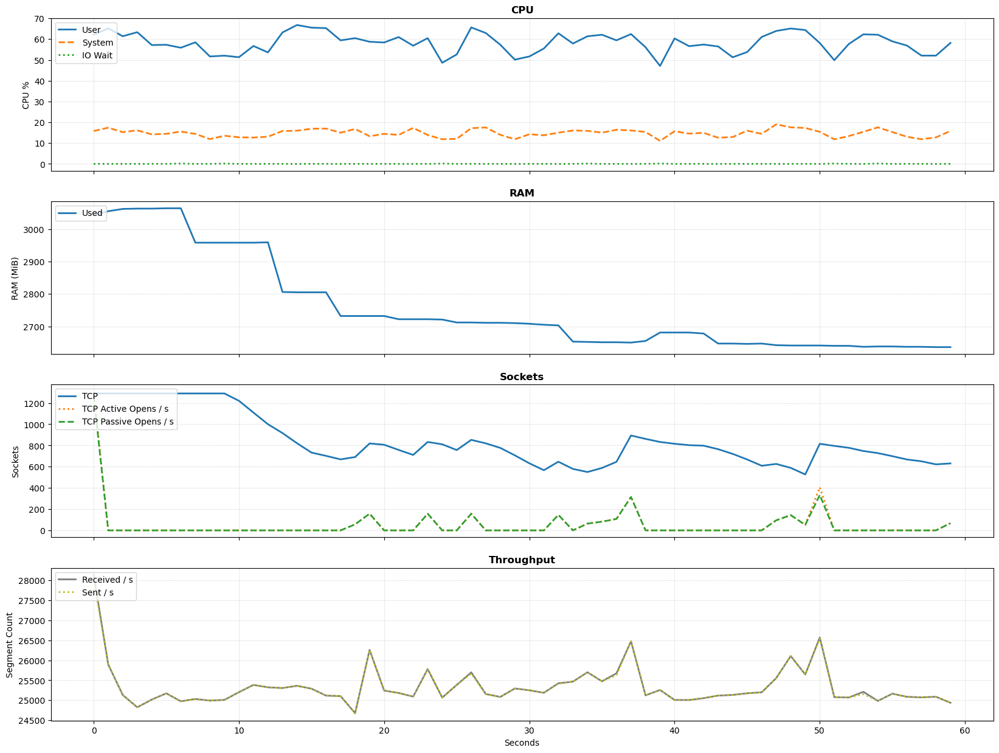
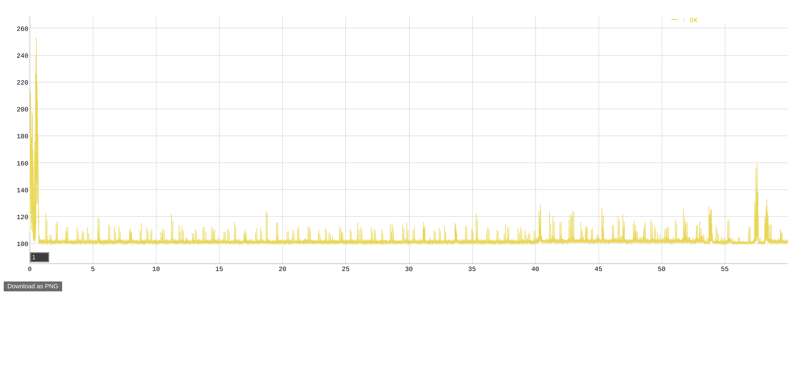

# Benchmark of Java Virtual Threads vs Webflux

This Java 21 project benchmarks a simple [Spring Boot 3.2.4](https://spring.io/projects/spring-boot) HTTP endpoint, comparing Java Virtual Threads (introduced by [Project Loom, JEP 444](https://openjdk.org/jeps/444)) with [Spring Webflux](https://docs.spring.io/spring-framework/reference/web/webflux.html) (relying on [Project Reactor](https://projectreactor.io/)):
* The benchmark is driven by [vegeta](https://github.com/tsenart/vegeta) which repeatedly issues HTTP GET requests to a service listening at http://localhost:8080/epoch-millis/$approach?delayMillis=$delayMillis
* The value of `$approach` in the URL is either `loom` or `webflux`.
* The service implementation consists of two steps:
  1. It waits `$delayMillis` (default: `100`) to mimic a network call, filesystem wait, or similar. Whilst the request waits, its operating system thread can be reused by another request. Both Loom and Webflux use their respective idiomatic ways to wait. 
  2. It then returns the milliseconds since the epoch.

## Setup 

The following instructions assume you are using a Debian-based Linux such as Ubuntu 22.04. 

### Increase Open File Limit

```shell
printf '* soft nofile 1048576\n* hard nofile 1048576\n' | sudo tee -a /etc/security/limits.conf 
```
Then log out and back in.


### Build Load Tester

We are using [vegeta](https://github.com/tsenart/vegeta) for driving the load test. Here's how to build it from source:

```shell
git clone https://github.com/tsenart/vegeta
cd vegeta
make vegeta
mv vegeta ~/bin
```

Make sure that the `vegeta` executable is in your `$PATH`.

## Benchmark 

The following command runs the benchmark first for Project Loom, then for Webflux:

```shell
./benchmark-all.sh 
```

Each benchmark run consists of the following steps:
* Build and start Spring Boot service with chosen approach (Loom or Webflux).
* Run two iterations of the benchmark. The result of each iteration is copied to the `results` folder, where each new iteration overwrites the previous one.
* Stop the service.

### Config

Configuration of the benchmark:
* Client: `benchmark.sh` configures `totalRate`, `connections`, `delayMillis` and `testIterationDuration`. Their values are logged during the benchmark.
* Service: `build-*.gradle` configures the heap space to 1 GiB.

### Results

The following is the output of the `./benchmark-all.sh` command when executed on the test environment described further below.

```
Starting service with loom approach
Service URL: http://localhost:8080/epoch-millis/loom?delayMillis=100
...........

Running benchmark: totalRate=5000/s, connections=5000, delayMillis=100, testIterationDuration=60s
Test iteration #1 started at Sat  6 Apr 08:41:46 BST 2024...
...warm-up iteration logs omitted...

Test iteration #2 started at Sat  6 Apr 08:42:51 BST 2024...
Measuring system using loom approach for 60 seconds...
Updated results/loom-system.csv
Requests      [total, rate, throughput]         300000, 5000.08, 4990.04
Duration      [total, attack, wait]             1m0s, 59.999s, 120.782ms
Latencies     [min, mean, 50, 90, 95, 99, max]  100.269ms, 103.618ms, 101.149ms, 107.692ms, 115.954ms, 150.531ms, 241.942ms
Bytes In      [total, mean]                     3900000, 13.00
Bytes Out     [total, mean]                     0, 0.00
Success       [ratio]                           100.00%
Status Codes  [code:count]                      200:300000  
Error Set:
Updated results/loom-system.png


Stopping service
{"message":"Shutting down, bye..."}

Starting service with webflux approach
Service URL: http://localhost:8080/epoch-millis/webflux?delayMillis=100


Running benchmark: totalRate=5000/s, connections=5000, delayMillis=100, testIterationDuration=60s
Test iteration #1 started at Sat  6 Apr 08:43:55 BST 2024...
...warm-up iteration logs omitted...

Test iteration #2 started at Sat  6 Apr 08:45:00 BST 2024...
Measuring system using webflux approach for 60 seconds...
Updated results/webflux-system.csv
Requests      [total, rate, throughput]         299999, 5000.06, 4991.65
Duration      [total, attack, wait]             1m0s, 59.999s, 100.993ms
Latencies     [min, mean, 50, 90, 95, 99, max]  100.297ms, 102.14ms, 100.976ms, 102.836ms, 107.14ms, 119.1ms, 308.556ms
Bytes In      [total, mean]                     3899987, 13.00
Bytes Out     [total, mean]                     0, 0.00
Success       [ratio]                           100.00%
Status Codes  [code:count]                      200:299999  
Error Set:
Updated results/webflux-system.png


Stopping service
{"message":"Shutting down, bye..."}
```

### Charts

The following charts show the client-side end-to-end request latencies (Y axis, in ms) over elapsed benchmark time (X axis, in seconds).
* The latency charts were exported from the HTML results in the `results` folder which were produced by the benchmark run above.
* The system resource chart with multiple subplots was generated using Python 3 and [matplotlib](https://matplotlib.org/) from the [sar](https://linux.die.net/man/1/sar) results gathered during the test run. Measurements refer to the entire system, across all processes. The system had a base-level CPU use of ca 1% before the test start.

#### Loom




#### Webflux




### Test Environment

The benchmark was performed on the following environment:

```
Java:   OpenJDK 64-Bit Server VM Corretto-21.0.2.13.1 (build 21.0.2+13-LTS, mixed mode, sharing)
OS:     PRETTY_NAME="Ubuntu 22.04.4 LTS"
Kernel: 5.15.86-051586-generic
CPU:    Model name:                      Intel(R) Core(TM) i7-6700K CPU @ 4.00GHz
Cores:  8
```

This output was obtained via:

```shell
printf "Java:\t" && java --version | grep "Server" && printf "OS:\t" && cat /etc/os-release | grep "PRETTY" && printf "Kernel:\t" && uname -r && printf "CPU:\t" && lscpu | grep "Model name" && printf "Cores:\t" && cat /proc/cpuinfo | awk '/^processor/{print $3}' | wc -l
```

