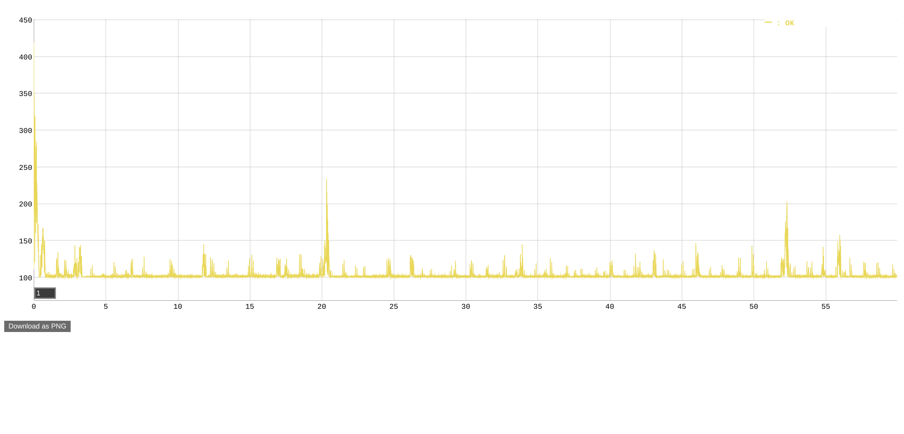
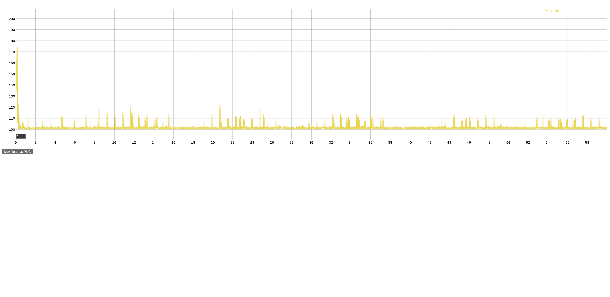

# Loom vs Webflux

This project benchmarks a simple Spring Boot web REST endpoint, comparing Virtual Threads (Project Loom) with Webflux.

The REST endpoint is invoked via GET, waits a configurable amount of time (default: 50ms) and then returns the millis since epoch.

## Preparation

### Increase Open File Limit

```shell
printf '* soft nofile 1048576\n* hard nofile 1048576\n' | sudo tee -a /etc/security/limits.conf 
```
Then log out and back in.


### Build vegeta Load Tester

```shell
git clone https://github.com/tsenart/vegeta
cd vegeta
make vegeta
mv vegeta ~/bin
```

Make sure that the `vegeta` executable is in your `$PATH`.

## Run Benchmarks

```shell
./benchmark-all.sh 
```

Output:
```
Starting server with loom approach


Running benchmark: rate=10000, max-workers=10000, max-connections=10000, duration=60s
Test iteration #1...
Requests      [total, rate, throughput]         600000, 10000.03, 9980.98
Duration      [total, attack, wait]             1m0s, 1m0s, 114.508ms
Latencies     [min, mean, 50, 90, 95, 99, max]  100.264ms, 103.625ms, 100.802ms, 106.702ms, 117.045ms, 163.565ms, 213.101ms
Bytes In      [total, mean]                     7800000, 13.00
Bytes Out     [total, mean]                     0, 0.00
Success       [ratio]                           100.00%
Status Codes  [code:count]                      200:600000  
Error Set:
Test iteration #2...
Requests      [total, rate, throughput]         600000, 9999.97, 9983.16
Duration      [total, attack, wait]             1m0s, 1m0s, 101.01ms
Latencies     [min, mean, 50, 90, 95, 99, max]  100.287ms, 103.694ms, 100.745ms, 106.884ms, 117.273ms, 161.225ms, 305.039ms
Bytes In      [total, mean]                     7800000, 13.00
Bytes Out     [total, mean]                     0, 0.00
Success       [ratio]                           100.00%
Status Codes  [code:count]                      200:600000  
Error Set:


Stopping server


Starting server with webflux approach
....INFO: Created TensorFlow Lite XNNPACK delegate for CPU.
.

Running benchmark: rate=10000, max-workers=10000, max-connections=10000, duration=60s
Test iteration #1...
Requests      [total, rate, throughput]         600000, 10000.03, 9983.20
Duration      [total, attack, wait]             1m0s, 1m0s, 101.111ms
Latencies     [min, mean, 50, 90, 95, 99, max]  100.297ms, 106.242ms, 100.445ms, 100.905ms, 102.745ms, 332.303ms, 741.836ms
Bytes In      [total, mean]                     7800000, 13.00
Bytes Out     [total, mean]                     0, 0.00
Success       [ratio]                           100.00%
Status Codes  [code:count]                      200:600000  
Error Set:
Test iteration #2...
Requests      [total, rate, throughput]         600000, 9999.99, 9983.22
Duration      [total, attack, wait]             1m0s, 1m0s, 100.824ms
Latencies     [min, mean, 50, 90, 95, 99, max]  100.297ms, 101.11ms, 100.436ms, 100.784ms, 101.563ms, 115.352ms, 256.291ms
Bytes In      [total, mean]                     7800000, 13.00
Bytes Out     [total, mean]                     0, 0.00
Success       [ratio]                           100.00%
Status Codes  [code:count]                      200:600000  
Error Set:


Stopping server
```

### Diagrams

The following diagrams were exported from the HTML results in the `results` folder which were produced by the benchmark run above. 




### Environment

The benchmarks found in the `results` folder were created by the second of two runs using the following commands.

```shell
printf "Java:\t" && java --version | grep "Server" && printf "OS:\t" && cat /etc/os-release | grep "PRETTY" && printf "Kernel:\t" && uname -r && printf "CPU:\t" && lscpu | grep "Model name" && printf "Cores:\t" && cat /proc/cpuinfo | awk '/^processor/{print $3}' | wc -l
```

Result:
```
Java:   OpenJDK 64-Bit Server VM Corretto-21.0.2.13.1 (build 21.0.2+13-LTS, mixed mode, sharing)
OS:     PRETTY_NAME="Ubuntu 22.04.4 LTS"
Kernel: 5.15.86-051586-generic
CPU:    Model name:                      Intel(R) Core(TM) i7-6700K CPU @ 4.00GHz
Cores:  8
```
