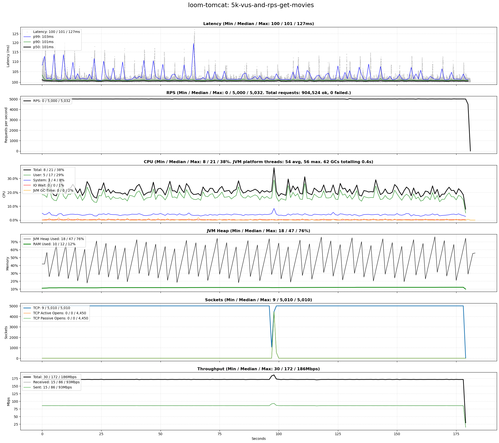
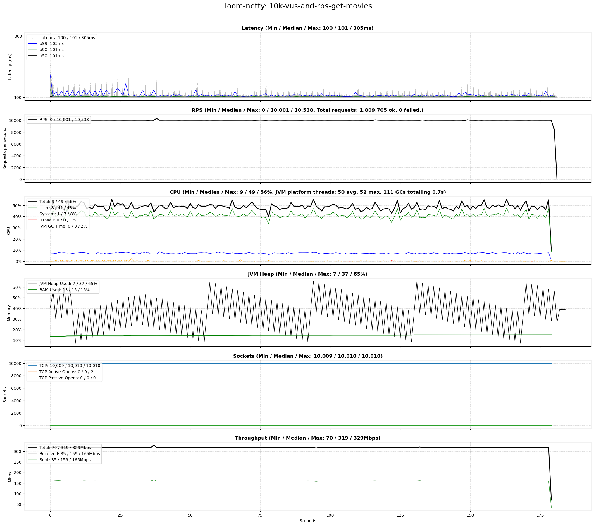
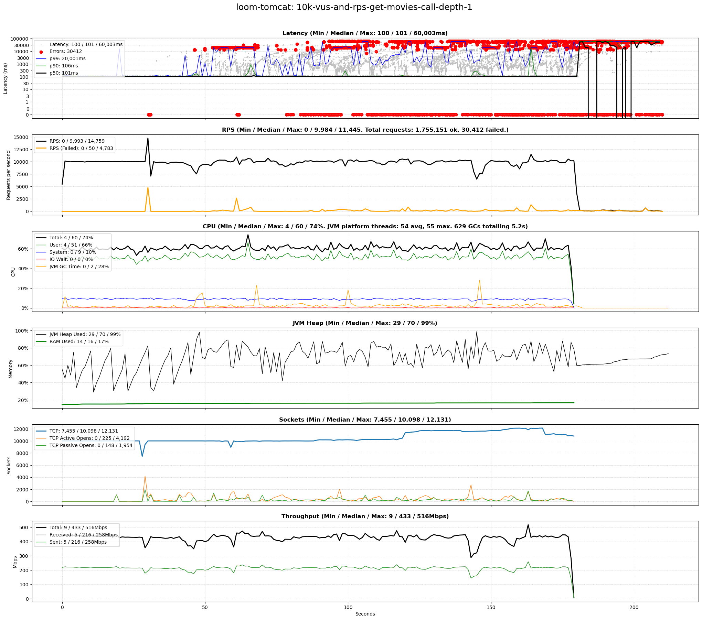
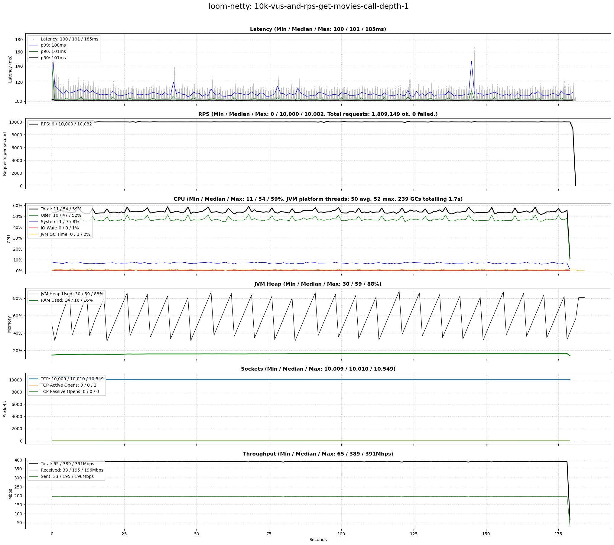
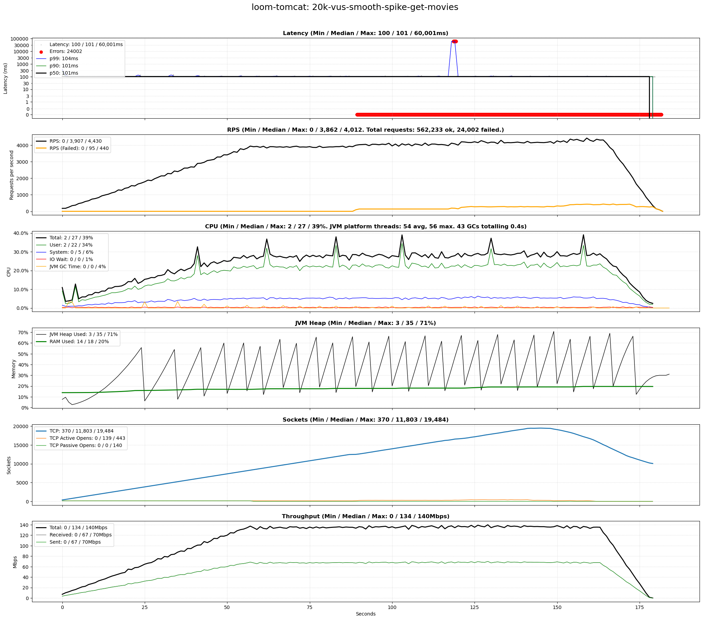
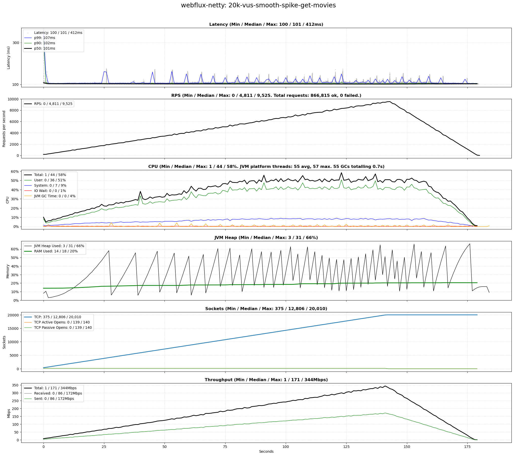
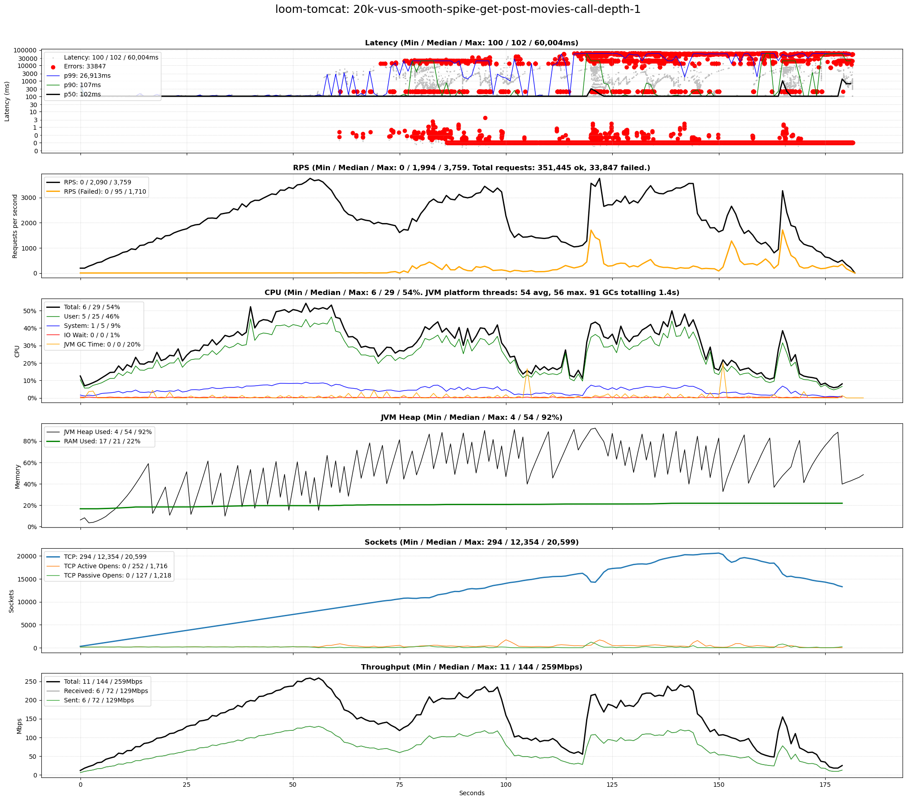
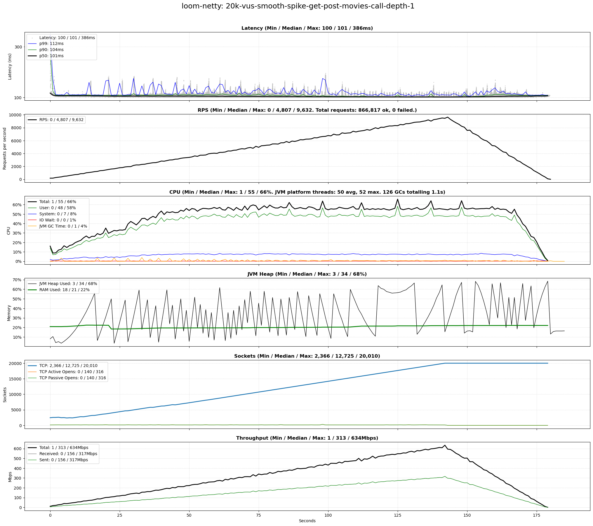
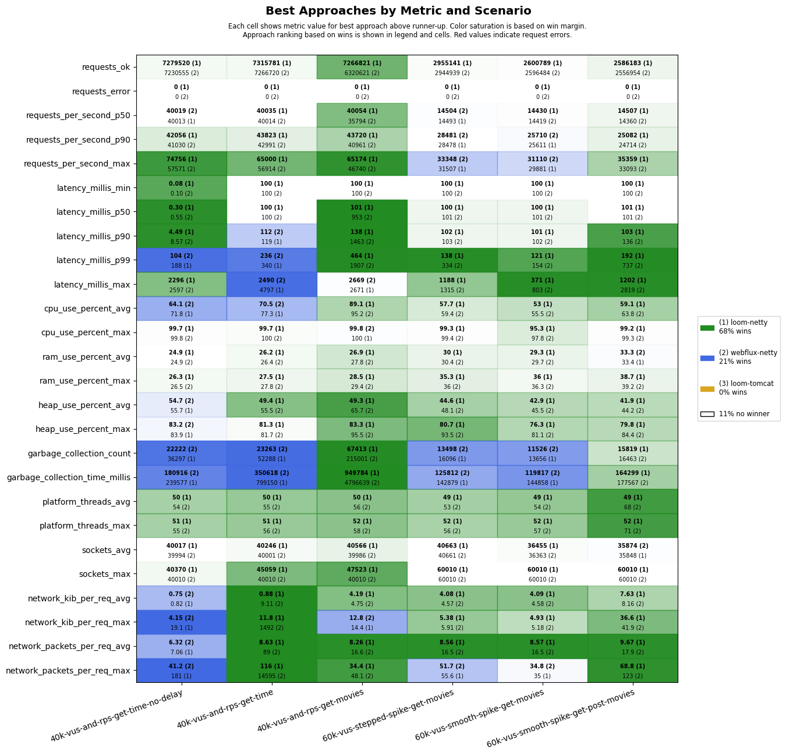
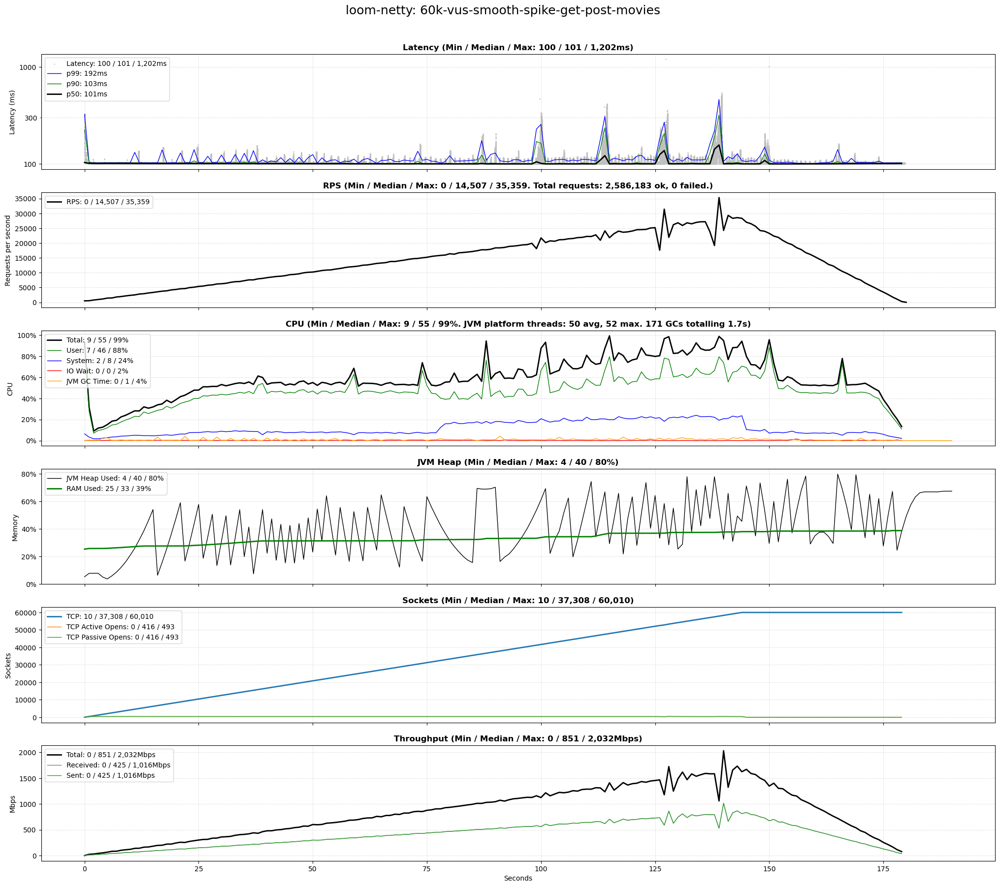

# Benchmark of Java Virtual Threads vs WebFlux

[](https://github.com/chrisgleissner/loom-webflux-benchmarks/actions)
[](https://github.com/chrisgleissner/loom-webflux-benchmarks/actions/workflows/benchmark.yaml)
[](https://github.com/chrisgleissner/loom-webflux-benchmarks/actions/workflows/soaktest.yaml)
[](https://coveralls.io/github/chrisgleissner/loom-webflux-benchmarks)

This Java 21 project benchmarks a simple [Spring Boot 3.3](https://spring.io/projects/spring-boot) microservice using
configurable scenarios, comparing Java Virtual Threads (introduced
by [Project Loom, JEP 444](https://openjdk.org/jeps/444)) using Tomcat and Netty
with [Spring WebFlux](https://docs.spring.io/spring-framework/reference/web/webflux.html) (relying
on [Project Reactor](https://projectreactor.io/)) using Netty.

All benchmark results below come from a dedicated bare metal test environment. The benchmark is also scheduled to run monthly on GitHub-hosted runners, using [all combinations](./results/ci/ci.md) of (Ubuntu 22.04, Ubuntu 24.04) and (Java 21, Java 22).

## Background

Both Spring WebFlux and Virtual Threads are alternative technologies to create Java microservices that support a high
number of concurrent users, mapping all incoming requests to very few shared operating system threads. This reduces the
resource overhead incurred by dedicating a single operating system thread to each user.

Spring WebFlux was first introduced in September 2017. Virtual Threads were first introduced as preview feature with
Java 19 and were fully rolled out with Java 21 in September 2023.

## TL;DR

> [!NOTE]
> In a nutshell, the benchmark results are:
>
> **Virtual Threads on Netty** (using [blocking code](https://docs.oracle.com/javase/8/docs/api/java/lang/Thread.html#sleep-long-)) showed very similar and often superior performance characteristics (latency percentiles, requests per second,
> system load) compared with **WebFlux on Netty** (using non-blocking code and relying on [Mono](https://projectreactor.io/docs/core/release/api/reactor/core/publisher/Mono.html)
> and [Flux](https://projectreactor.io/docs/core/release/api/reactor/core/publisher/Flux.html) from Project Reactor):
> - Virtual Threads on Netty was the [benchmark winner](#Netty-based-Approaches) for ca. 40% more combinations of metrics and benchmark scenarios than Project Reactor on Netty.
> - For all high user count scenarios, it had the lowest latency as well as the largest number of requests for the entirety of each benchmark run.
> - In many cases (e.g. [60k-vus-smooth-spike-get-post-movies](#60k-vus-smooth-spike-get-post-movies)), the 90th and 99th percentile latencies (P90 and P99)
    were considerably lower for Virtual Threads on Netty when compared with WebFlux on Netty.
> - For both approaches, we could scale up to the same number of virtual users (and thus TCP connections) before
    exhausting the CPU and running into time-outs due to rejected TCP connection requests.
>
> **Virtual Threads on Tomcat** are not recommended for high load:
> - We saw considerably higher resource use compared with the two Netty-based approaches.
> - There were many time-out errors as visualized by red dots in the charts, even when the CPU use was far below 100%. In contrast, none the Netty-based scenarios experienced any errors, even with a CPU use of 100%.

## Benchmark Winners

Below are top-performing approaches across all scenarios and metrics, visualizing the contents of [results/scenarios-default/results.csv](results/scenarios-default/results.csv):

- Each cell shows the metric values of best approach (on top) and runner-up.
    - What "best" is depends on the metric: A lower value is better for all metrics except for metrics starting with `requests_ok`, `requests_per_second`, or `sockets`.
    - Approaches which encountered request errors are ranked below those approaches with only successful requests. Such "failed" approaches have all their metric values printed in red and suffixed with `E`.
    - An overall ranking based on the win count of each approach is shown in the legend: `(1)` indicates the overall best approach, `(2)` the runner-up, and so on. This overall ranking is also shown next to each metric value.
- Cells are colored based on the winning approach. The darker the color, the bigger the lead of the winning approach over the runner-up. If cells are white or faded, there's no clear winner as the top two approaches performed similarly.
- For [detailed charts](#Charts) on each approach and test scenario combination, have a look at the second half of this document.
- All measurements below were performed on the dedicated, non-virtualized test environment described under [Results](#Results). Additional [monthly measurements](./results/ci/ci.md) are performed on virtualized GitHub-hosted Runners.

### All Approaches

This chart compares Project Loom (on both Tomcat and Netty) with Project Reactor (on Netty).


### Netty-based Approaches

This chart is based on same benchmark as before, but only considers Netty-based approaches.


## Benchmark Features

* Fully automated and CLI-driven by running a single command: `benchmark.sh`.
* Different test scenario files, each containing one or more scenarios. Example: `src/main/resources/scenarios/scenario.csv`.
* Operating system thread re-use by waiting and by performing transitive HTTP calls of configurable call depth.
* Interacts with realistic JSON APIs.
* Creates single PNG image via [Matplotlib](https://matplotlib.org/) for each combination of scenario and approach which contains:
    * Raw latencies and P50/90/99 percentiles, as well as any errors.
    * System metrics for CPU, RAM, sockets, and network throughput.
    * JVM metrics such as heap usage, garbage collections (GCs), and platform thread count.
* Creates summary PNG image of all scenarios which shows best approaches.

## Benchmark Design

The benchmark is driven by [k6](https://k6.io/docs/) which repeatedly issues HTTP requests to a service listening at http://localhost:8080/

The service exposes multiple REST endpoints. The implementation of each has the same 3 stages:

1. **HTTP Call**: If `$delayCallDepth > 0`, call `GET /$approach/epoch-millis` recursively `$delayCallDepth` times to mimic calls to upstream service(s).
    - By default, all approaches use `Spring Boot`'s [WebFlux WebClient](https://docs.spring.io/spring-framework/reference/integration/rest-clients.html#rest-webclient)
      based on Netty.
    - The scenarios in [scenarios-clients.csv](src/main/resources/scenarios/scenarios-clients) compare the `WebClient` with Spring Boot's
      [RestClient](https://docs.spring.io/spring-framework/reference/integration/rest-clients.html#rest-restclient) using various client implementations. For details see the [Multi-Client Scenarios](#multi-client-scenarios) chapter.
2. **Wait**: If `$delayCallDepth = 0`, wait `$delayInMillis` (default: `100`) to mimic the delay incurred by a network call, filesystem access, or similar.
    - Whilst the request waits, its operating system thread can be reused by another request.
    - The imperative approaches (`platform-tomcat`, `loom-tomcat`, and `loom-netty`) use blocking wait whilst the reactive approach (`webflux-netty`) uses non-blocking wait.
3. **Calculate and Return Response** specific to REST endpoint.

### Sample Flow

Get all [movies](#movies) using `loom-netty` approach, an HTTP call depth of `1` and a delay of `100` milliseconds:


### REST APIs

The microservice under test exposes several RESTful APIs. In the following descriptions, `$approach` is the approach
under test and can be one of `loom-tomcat`, `loom-netty`, and `webflux-netty`.

All REST APIs support the following query parameters:

- `delayCallDepth`: Depth of recursive HTTP call stack to `$approach/epoch-millis` endpoint prior to server-side delay; see [Scenario Columns](#Columns) for more details.
- `delayInMillis`: Server-side delay in milliseconds; see [Scenario Columns](#Columns) for more details.

#### epoch-millis

The [TimeController](src/main/java/uk/gleissner/loomwebflux/time/TimeController.java) returns the milliseconds since the
epoch, i.e. 1 Jan 1970:

- This is one of the simplest possible APIs to provide a best-case performance scenario.
- Supported requests:
    - `GET /$approach/epoch-millis`

#### movies

The [MovieController](src/main/java/uk/gleissner/loomwebflux/movie/MovieController.java) gets and saves movies which are
stored in an [H2](https://h2database.com/) in-memory DB via [Spring Data JPA](https://spring.io/projects/spring-data-jpa), fronted by a [Caffeine](https://github.com/ben-manes/caffeine)-backed [Spring Boot cache](https://docs.spring.io/spring-boot/reference/io/caching.html):

- This is a realistic JSON API as exposed by a typical microservice.
- Several hard-coded movies by three directors are provided.

DB Considerations:

- By default, writes are not saved since the code under test is identical for all approaches and would thus only
  contribute to CPU use. However, this can be controlled with the Spring Boot property `loom-webflux.repo-read-only`
  in `src/main/resources/application.yaml`.
- The H2 DB was chosen for the same reason. To swap it for PostgreSQL, specify `postgres` in the `serverProfiles` column of the scenario CSV file. See [scenarios-postgres.csv](./src/main/resources/scenarios/scenarios-postgres.csv)
  and [PostgreSQL results](results/scenarios-postgres/results-netty.png).

Supported requests:

- `GET /$approach/movies?directorLastName={director}`:
    - Returns movies by the specified director.
    - Supported `{director}` values and their respective response body size in bytes, based on the default movies:
        - `Allen`: 1597 bytes (unindented)
        - `Hitchcock`: 1579 bytes (unindented)
        - `Kubrick`: 1198 bytes (unindented)
- `POST /$approach/movies`:
    - Saves one or more movies.
    - The [sample movies](src/main/resources/scenarios/movies.json) saved during the load tests measure 7288 bytes (indented).

## Requirements

### Software

* Unix-based OS; tested with Ubuntu 22.04 and 24.04
* Java 21 or above
* [k6](https://k6.io/docs/) and Python 3 with [Matplotlib](https://matplotlib.org/) to drive load and measure latency
* [sar/sadf](https://linux.die.net/man/1/sar) to measure system resource use
* Python 3 and [Matplotlib](https://matplotlib.org/) to convert latency and system CSV measurements into a PNG image

### Hardware

The hardware requirements depend purely on the scenarios configured in `src/main/resources/scenarios/scenarios-default.csv`. The following is
recommended to run the default scenarios committed to this repo:

* CPU comparable to Intel 6700K or above
* 16 GiB RAM

## Setup

The following instructions assume you are using a Debian-based Linux such as Ubuntu 22.04 or 24.04.

### Java 21

You'll need Java 21 or above:

```shell
sudo apt install openjdk-21-jdk
```

### k6

[k6](https://k6.io/docs/) is used to load the service:

```shell
sudo gpg -k
sudo gpg --no-default-keyring --keyring /usr/share/keyrings/k6-archive-keyring.gpg --keyserver hkp://keyserver.ubuntu.com:80 --recv-keys C5AD17C747E3415A3642D57D77C6C491D6AC1D69
echo "deb [signed-by=/usr/share/keyrings/k6-archive-keyring.gpg] https://dl.k6.io/deb stable main" | sudo tee /etc/apt/sources.list.d/k6.list
sudo apt-get update
sudo apt-get install k6
```

### Python 3, matplotlib, sar and sadf

Python 3 and `matplotlib` are used to convert the CSV output of `k6` and `sar`/`sadf` to a single PNG chart. The `sar`
and `sadf` tools come as part of `sysstat` and are used to measure resource use. To install them run:

```shell
sudo apt update && sudo apt install -y python3 python3-matplotlib sysstat
```

### Linux Optimizations

The following adjustments optimize Linux for HTTP load tests.

#### Increase Open File Limit

Ensure your system can handle a large number of concurrent connections:

```shell
printf '* soft nofile 1048576\n* hard nofile 1048576\n' | sudo tee -a /etc/security/limits.conf 
```

#### Increase Port Range and Allow Fast Connection Reuse

Increase the port range for outgoing TCP connections and allow quick connection reuse:

```shell
printf 'net.ipv4.ip_local_port_range=1024 65535\nnet.ipv4.tcp_tw_reuse = 1\n' | sudo tee -a /etc/sysctl.conf && sudo sysctl -p
```

#### Activate Changes

Log out and back in.

## Execution

### benchmark.sh

Run a benchmark for each combination of approaches and scenarios defined in a scenario CSV file. Results are stored in
`build/results/`:

```shell
./benchmark.sh 
```

Usage as per `benchmark.sh -h`:

```
Usage: benchmark.sh [OPTION]... [SCENARIO_FILE]
Runs benchmarks configured by a scenario file.

SCENARIO_FILE:     Scenario configuration CSV file in src/main/resources/scenarios/. Default: scenarios-default.csv

OPTION:
  -a <approaches>  Comma-separated list of approaches to test. Default: loom-tomcat, loom-netty, webflux-netty
                   Supported approaches: platform-tomcat, loom-tomcat, loom-netty, webflux-netty
  -C               Keep CSV files used to create chart. Default: false
  -h               Print this help
```

### benchmarks.sh

This is a wrapper over `benchmark.sh` and supports multiple scenario files:

```shell
./benchmarks.sh 
```

Usage as per `benchmarks.sh -h`:

```
Usage: benchmarks.sh [OPTION]... [SCENARIO_FILE]...
Wrapper over benchmark.sh that supports multiple scenario files and optionally suspends the system on completion.

SCENARIO_FILE:           Zero or more space-separated scenario configuration CSV files in src/main/resources/scenarios/.
                         Default: scenarios-default.csv scenarios-deep-call-stack.csv scenarios-postgres.csv scenarios-sharp-spikes.csv scenarios-soaktest.csv

OPTION:
  -d, --dry-run          Print what would be done without actually performing it.
  -k, --kill-java        Kill all Java processes after each benchmark. Default: false
  -o, --options "<opts>" Pass additional options to the benchmark.sh script. Run "./benchmark.sh -h" for supported options.
  -s, --suspend          Suspend the system upon completion of the script. Default: false
  -h, --help             Show this help message and exit.
```

Please note that the default configured scenarios may take several hours to complete.

### Approaches

- **platform-tomcat**: Platform threads using [Tomcat](https://tomcat.apache.org/) server
- **loom-tomcat**: Virtual Threads using [Tomcat](https://tomcat.apache.org/) server
- **loom-netty**: Virtual Threads on [Netty](https://netty.io/) server
- **webflux-netty**: WebFlux on Netty server

All approaches use the same Spring Boot 3.2 version.

### Scenarios

#### Default Scenarios

see [src/main/resources/scenarios/scenarios-default.csv](src/main/resources/scenarios/scenarios-default.csv)

| Scenario                                                                                                | Domain | Description                           | Virtual Users (VU) | Requests per Second (RPS)   | Client delay (ms)    | Server delay (ms) | Delay Call Depth |
|---------------------------------------------------------------------------------------------------------|--------|---------------------------------------|--------------------|-----------------------------|----------------------|-------------------|------------------|
| smoketest                                                                                               | Time   | Smoke test                            | 5                  | 5                           | 0                    | 100               | 0                |
| [5k-vus-and-rps-get-time](#5k-vus-and-rps-get-time)                                                     | Time   | Constant users, constant request rate | 5,000              | 5,000                       | 0                    | 100               | 0                |
| [5k-vus-and-rps-get-movies](#5k-vus-and-rps-get-movies)                                                 | Movies | Constant users, constant request rate | 5,000              | 5,000                       | 0                    | 100               | 0                |
| [10k-vus-and-rps-get-movies](#10k-vus-and-rps-get-movies)                                               | Movies | Constant users, constant request rate | 10,000             | 10,000                      | 0                    | 100               | 0                |
| [10k-vus-and-rps-get-movies-call-depth-1](#10k-vus-and-rps-get-movies-call-depth-1)                     | Movies | Constant users, constant request rate | 10,000             | 10,000                      | 0                    | 100               | 1                |
| [20k-vus-stepped-spike-get-movies](#20k-vus-stepped-spike-get-movies)                                   | Movies | Stepped user spike                    | 0 - 20,000         | Depends on users and delays | 1000 - 3000 (random) | 100               | 0                |
| [20k-vus-smooth-spike-get-movies](#20k-vus-smooth-spike-get-movies)                                     | Movies | Smooth user spike                     | 0 - 20,000         | Depends on users and delays | 1000 - 3000 (random) | 100               | 0                |
| [20k-vus-smooth-spike-get-post-movies](#20k-vus-smooth-spike-get-post-movies)                           | Movies | Smooth user spike                     | 0 - 20,000         | Depends on users and delays | 1000 - 3000 (random) | 100               | 0                |
| [20k-vus-smooth-spike-get-post-movies-call-depth-1](#20k-vus-smooth-spike-get-post-movies-call-depth-1) | Movies | Smooth user spike                     | 0 - 20,000         | Depends on users and delays | 1000 - 3000 (random) | 100               | 1                |

#### High-Load Scenarios

The scenarios examine particularly high load.

- Config: [./src/main/resources/scenarios/scenarios-high-load.csv](./src/main/resources/scenarios/scenarios-high-load.csv)
- Results: [./results/scenarios-high-load/results.png](./results/scenarios-high-load/results.png)

#### Multi-Client Scenarios

These scenarios compare both Spring Boot [RestClient](https://docs.spring.io/spring-framework/reference/integration/rest-clients.html#rest-restclient) and
[WebClient](https://docs.spring.io/spring-framework/reference/integration/rest-clients.html#rest-webclient) implementations with each other.

- Config: [./src/main/resources/scenarios/scenarios-clients.csv](./src/main/resources/scenarios/scenarios-clients.csv)
- Results: [./results/scenarios-clients/results.md](./results/scenarios-clients/results.md)

The following clients are compared:

- Spring Boot `RestClient` based on:
    - [JDK HttpClient](https://docs.oracle.com/en/java/javase/11/docs/api/java.net.http/java/net/http/HttpClient.html)
    - [Apache Commons HttpClient 5](https://hc.apache.org/httpcomponents-client-5.4.x/current/httpclient5/apidocs/)
    - [Netty](https://projectreactor.io/docs/netty/1.1.21/api/reactor/netty/http/client/HttpClient.html)
- Spring Boot `WebClient` based on:
    - [Netty](https://projectreactor.io/docs/netty/1.1.21/api/reactor/netty/http/client/HttpClient.html)

#### Other Scenarios

- [deep-call-stack](./results/scenarios-deep-call-stack/results.md): High delay call depths
- [postgres](./results/scenarios-postgres/results.md): Use PostgreSQL (started via Docker) instead of H2
- [sharp-spikes](./results/scenarios-sharp-spikes/results.md): Intermittent sharp load spikes from 0 to 10/20/30k users
- [soaktest](./results/scenarios-soaktest/results.md): Slow ramp-uo to 10k users over 15 minutes, followed by ramp-down

### Steps

The benchmark run for each `$scenario` consists of the following phases and steps:

#### Before Benchmark

* Build and start the Spring Boot service with a specific `$approach` as Spring Boot profile, using the config in `src/main/resources/application.yaml` and overridden by `src/main/resources/application-$approach.yaml` if defined.

#### Benchmark

* Run the benchmark as configured by the `$scenario`.
* For each `$resultType` (i.e. `latency`, `system`, or `jvm`), create a CSV file at `build/results/$scenario/$approach-$resultType.csv`.

#### After Benchmark

* Convert CSV files into `build/results/$scenario/$approach.png`
* Delete the CSV files unless the `-C` CLI option was specified.
* Stop the service.

## Config

### Common

- The `build.gradle` file configures the heap space to 2 GiB.
- The `src/main/resources/application.yaml` file enables HTTP/2.
- Time-out is 60s for both client and server.

### Scenario-specific

Each line in [src/main/resources/scenarios/scenarios-default.csv](src/main/resources/scenarios/scenarios-default.csv) configures a test scenario which is performed first for Java
Virtual Threads, then for WebFlux.

#### Example

| scenario                         | k6Config                               | serverProfiles | delayCallDepth | delayInMillis | connections | requestsPerSecond | warmupDurationInSeconds | testDurationInSeconds |
|----------------------------------|----------------------------------------|----------------|----------------|---------------|-------------|-------------------|-------------------------|-----------------------|
| 5k-vus-and-rps-get-time          | get-time.js                            |                | 0              | 100           | 5000        | 5000              | 10                      | 300                   |
| 20k-vus-smooth-spike-get-movies] | k6-20k-vus-smooth-spike-get-movies].js | postgres       | 0              | 100           | 20000       |                   | 0                       | 300                   |

#### Columns

1. `scenario`: Name of scenario. Is printed on top of each diagram.
2. `k6Config`: Name of the [K6 Config File](https://k6.io/docs/using-k6/http-requests/) which is assumed to be in
   the `config` folder
3. `serverProfiles`: Pipe-delimited Spring profiles which are also used to start and stop Docker containers. For example, specifying the value `postgres|no-cache` has these effects:
    - The Spring Boot profiles `postgres,no-cache` are added to the default Spring Boot profile of `$approach`.
    - The files `src/main/docker/docker-compose-postgres.yaml` and `src/main/docker/docker-compose-no-cache.yaml` (if existent)
      are used to start/stop Docker containers before/after each scenario run.
3. `delayCallDepth`: Depth of recursive HTTP call stack to `$approach/epoch-millis` endpoint prior to server-side delay.
    - Mimics calls to upstream services which allow for reuse of the current platform thread.
    - For example, a value of `0` means that the service waits for `$delayInMillis` milliseconds immediately upon receiving a request.
    - Otherwise, it calls the `$approach/epoch-millis` with `${delayCallDepth - 1}`.
    - This results in a recursive HTTP-request-based descent into the service, creating a call stack of depth `$delayCallDepth`.
3. `delayInMillis`: Server-side delay of each request, in milliseconds. Mimics a delay such as invoking a DB which allow for reuse of the current platform thread.
4. `connections`: Number of TCP connections, i.e. virtual users.
5. `requestsPerSecond`: Number of requests per second across all connections. Left empty for scenarios where the number
   of requests per second is organically derived based on the number of connections, the request latency, and any
   explicit client-side delays.
6. `warmUpDurationInSeconds`: Duration of the warm-up iteration before the actual test. Warm-up is skipped if `0`.
7. `testDurationInSeconds`: Duration of the test iteration.

## Results

### Test Environment

- Unless noted otherwise, all tests were conducted on this test environment.
- **Preparation**: The system was rebooted before each test and quieted down as much as possible. The baseline total CPU
  use before test start was 0.3%.
- **Co-location**: Test driver (k6) and server under test (Spring Boot microservice) were co-located on the same
  physical machine. The aim of this benchmark is not to achieve maximum absolute performance, but rather to compare
  different server-side approaches with each other. Considering that the test driver and the load it produced was
  identical for the combination of server-side approach and scenario, this co-location should not affect the validity of
  the test results.

### Hardware

- CPU: Intel Core i7-6700K at 4.00GHz with 4 cores (8 threads)
- Motherboard: Asus Z170-A
- RAM: 32 GiB DDR4 (2 x Corsair 16 GiB, 2133 MT/s)
- Network: Loopback interface
- Virtualization: None; bare metal desktop

### Software

- OS: Ubuntu 24.04.1 LTS
- Kernel: 6.8.0-41-generic
- Java: Amazon Corretto JDK 21.0.4.7.1
- Spring Boot 3.3.3

## Charts

The following charts show the results of each scenario, sorted by ascending scenario load.

### Errors

Any lines in the client-side or error-side log files which contain the term `error` (case-insensitive) are preserved. You can find them in error log files, located in the results folder alongside the generated PNG files.

Any failed requests appear both in the latency chart as red dots, as well as in the RPS chart as part of a continuous orange
line. Additionally, they leave a trace in the `$approach-latency.csv` file, if preserved by running the benchmark with the `-C` option:

- A very small latency below 3ms indicates that the client failed to establish a TCP connection. Example from the latency CSV file: `1715728866471,0.000000,0,dial: i/o timeout,1211`. Such requests are not considered when reporting minimum latency since this could obscure the minimum latency of
  successful requests.
- A very large latency above 60s indicates a server-side time-out. Example from the latency CSV file: `1715728861008,60001.327066,0,request timeout,1050`.

### 5k-vus-and-rps-get-time

This scenario aims to maintain a steady number of 5k virtual users (VUs, i.e. TCP connections) as well as 5k requests
per second (RPS) across all users for 3 minutes:

- Each user issues a request and then waits. This wait between consecutive requests is controlled by k6 in order to
  achieve the desired number of RPS.
- The server-side delay is 100ms.
- The server returns the current millis since the epoch.

#### Virtual Threads (Tomcat)


#### Virtual Threads (Netty)


#### WebFlux (Netty)


### 5k-vus-and-rps-get-movies

Like the previous scenario, but the response body contains a JSON of movies.

For further details, please see the [movies](#movies) section.

#### Virtual Threads (Tomcat)



#### Virtual Threads (Netty)


#### WebFlux (Netty)


### 10k-vus-and-rps-get-movies

Like the previous scenario, but 10 virtual users and requests per second.

#### Virtual Threads (Tomcat)


#### Virtual Threads (Netty)



#### WebFlux (Netty)


### 10k-vus-and-rps-get-movies-call-depth-1

Like the previous scenario, but mimics a request to an upstream service.

- On receiving an incoming HTTP request, the service calls itself via HTTP.
- This secondary request then waits 100 milliseconds.

#### Virtual Threads (Tomcat)



#### Virtual Threads (Netty)



#### WebFlux (Netty)


### 20k-vus-stepped-spike-get-movies

This scenario ramps up virtual users (and thus TCP connections) from 0 to 20k in multiple steps, then back down:

- Each step has a short [riser](https://en.wikipedia.org/wiki/Stair_riser) time when users are increased,
  followed by a longer [tread](https://en.wikipedia.org/wiki/Stair_tread) time when users are held
  constant.
- Each user issues a request, waits for the response, and then waits for a random delay between 1s and 3s. This reduces
  the load and better mimics real user interactions with a service, assuming the service calls are driven by user
  interactions with a website that relies on the service under test.
- The server-side delay before returning a response is 100ms.

#### Virtual Threads (Tomcat)


#### Virtual Threads (Netty)


#### WebFlux (Netty)


### 20k-vus-smooth-spike-get-movies

Like the previous scenario, but linear ramp-up and down.

#### Virtual Threads (Tomcat)



#### Virtual Threads (Netty)


#### WebFlux (Netty)



### 20k-vus-smooth-spike-get-post-movies

Like the previous scenario, but instead of just getting movies, we are now additionally saving them:

- 75% of requests are GET requests which are split into three groups, each requesting movies by a different director.
- 25% of requests are POST requests.

For further details, please see the [movies](#movies) section.

#### Virtual Threads (Tomcat)


#### Virtual Threads (Netty)


#### WebFlux (Netty)


### 20k-vus-smooth-spike-get-post-movies-call-depth-1

Like the previous scenario, but mimics call to upstream service as explained in [10k-vus-and-rps-get-movies-call-depth-1](#10k-vus-and-rps-get-movies-call-depth-1).

> [!NOTE]
> For `loom-netty` and `webflux-netty`, this scenario was CPU-contended on the test environment upon reaching ca. 5,000 RPS.
> Whilst causing no errors, it drastically increased latencies.

#### Virtual Threads (Tomcat)



#### Virtual Threads (Netty)



#### WebFlux (Netty)


## High Load Results

The following results are based on `scenarios-high-load.csv` which scales up to 60k users. They were executed in a VirtualBox VM on more powerful hardware and
using a different Linux Kernel version.

### Hardware

- CPU: Intel Core i7-12700K at 5GHz with 12 cores (20 threads)
- Motherboard: Asus ProArt Z690 Creator
- RAM: 64 GiB DDR4 (2 x Corsair 32 GiB, 5600MT/s)
- Network: Loopback interface
- Virtualization: VirtualBox 7.0.14 r161095 on bare metal desktop. All cores and 32GiB assigned to VM.

### Software

- Host OS: Windows 11 Pro (10.0.22631)
- Client OS: Ubuntu 22.04.4 LTS
- Client Kernel: 6.5.0-45-generic
- Java: Amazon Corretto JDK 21.0.4.7.1
- Spring Boot 3.3.2

### Summary



### 60k-vus-smooth-spike-get-post-movies

Like [20k-vus-smooth-spike-get-post-movies](#20k-vus-smooth-spike-get-post-movies), but scaling up to 60k users.

#### Virtual Threads (Netty)



#### WebFlux (Netty)


