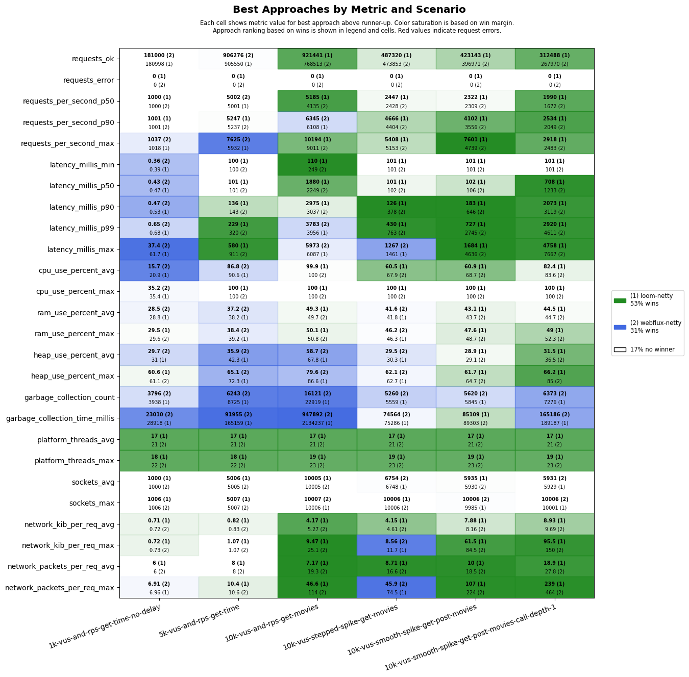
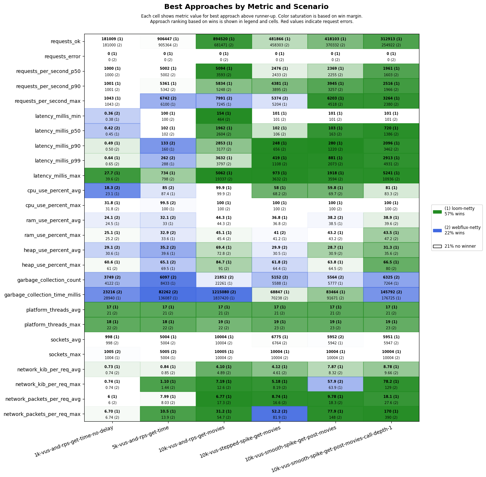
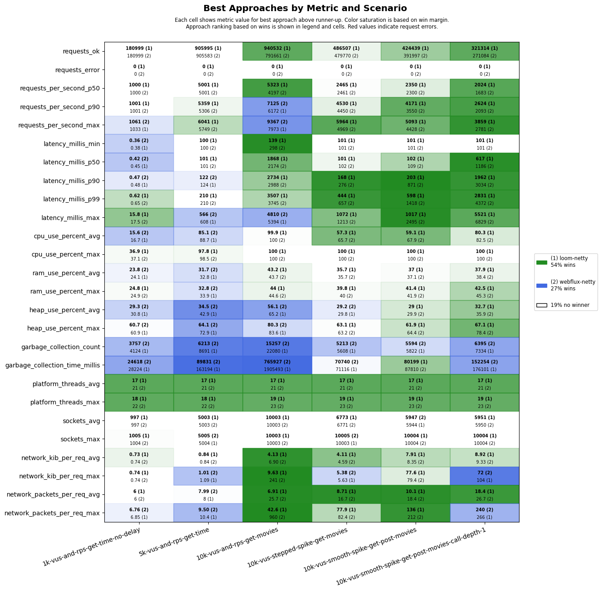

# Benchmark Winners on GitHub-hosted Runners

This page shows benchmark winners based on automatic monthly runs performed on [GitHub-hosted runners](https://docs.github.com/en/actions/using-github-hosted-runners/about-github-hosted-runners/about-github-hosted-runners).

> [!NOTE]
> GitHub-hosted runners are virtualized and multiple runners may share the same physical machine which may impact measurements.

## scenarios-ci

Test Config: [scenarios-ci.csv](../../src/main/resources/scenarios/scenarios-ci.csv)

### Ubuntu 22.04 + Java 21

### Ubuntu 22.04 + Java 22

### Ubuntu 24.04 + Java 21

### Ubuntu 24.04 + Java 22

