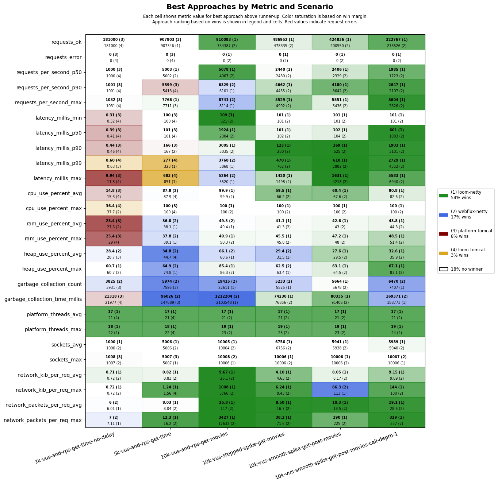
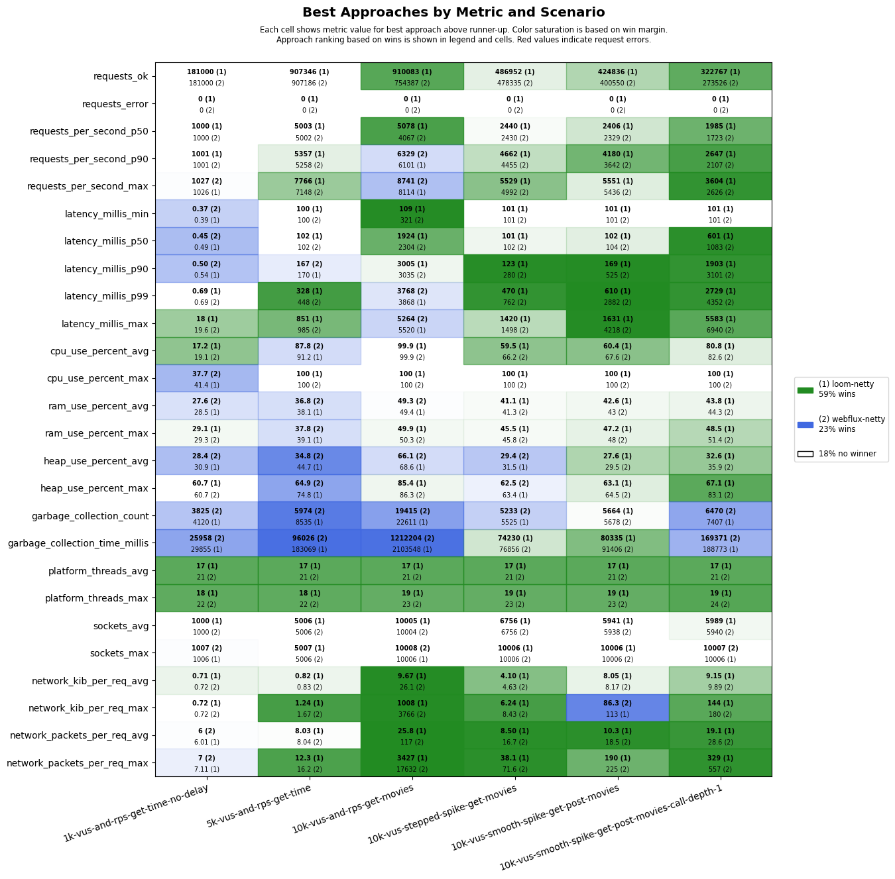

# scenarios-ci

## Test Time

| **Name**                | **Value** |
|-------------------------|-----------|
| **Start (UTC)** | 2025-08-02 03:27:39 |
| **End (UTC)** | 2025-08-02 04:51:22 |
| **Duration (hh:mm:ss)** | 01:23:43 |

## System Specs

| **Name**                | **Value** |
|-------------------------|-----------|
| **Java** | OpenJDK 64-Bit Server VM Corretto-21.0.8.9.1 (build 21.0.8+9-LTS, mixed mode, sharing) |
| **Spring Boot** | 3.5.4 |
| **Python** | 3.12.3 |
| **OS** | Ubuntu 24.04.2 LTS |
| **Kernel** | 6.11.0-1018-azure |
| **CPU** | AMD EPYC 7763 64-Core Processor |
| **CPU Cores** | 4 |
| **RAM** | 15Gi total, 12Gi available |
| **Disk** | 159G total, 103G available |

## Scenarios

**Scenario file:** src/main/resources/scenarios/scenarios-ci.csv

| Scenario | k6 Config | Server Profiles | Delay Call Depth | Delay (ms) | Connections | Requests per Second | Warmup Duration (s) | Test Duration (s) |
|----------|-----------|-----------------|------------------|------------|-------------|---------------------|---------------------|------------------|
| [1k-vus-and-rps-get-time-no-delay](#1k-vus-and-rps-get-time-no-delay) | get-time.js |  | 0 | 0 | 1000 | 1000 | 10 | 180 |
| [5k-vus-and-rps-get-time](#5k-vus-and-rps-get-time) | get-time.js |  | 0 | 100 | 5000 | 5000 | 10 | 180 |
| [10k-vus-and-rps-get-movies](#10k-vus-and-rps-get-movies) | get-movies.js |  | 0 | 100 | 10000 | 10000 | 10 | 180 |
| [10k-vus-stepped-spike-get-movies](#10k-vus-stepped-spike-get-movies) | get-movies-stepped-vus-spike.js |  | 0 | 100 | 10000 |  | 0 | 180 |
| [10k-vus-smooth-spike-get-post-movies](#10k-vus-smooth-spike-get-post-movies) | get-post-movies-smooth-vus-spike.js |  | 0 | 100 | 10000 |  | 0 | 180 |
| [10k-vus-smooth-spike-get-post-movies-call-depth-1](#10k-vus-smooth-spike-get-post-movies-call-depth-1) | get-post-movies-smooth-vus-spike.js |  | 1 | 100 | 10000 |  | 0 | 180 |

## Result Overview

### Overall

### Netty-based

## Result Details

### 1k-vus-and-rps-get-time-no-delay

#### platform-tomcat

#### loom-tomcat

#### loom-netty

#### webflux-netty

### 5k-vus-and-rps-get-time

#### platform-tomcat

#### loom-tomcat

#### loom-netty

#### webflux-netty

### 10k-vus-and-rps-get-movies

#### platform-tomcat

#### loom-tomcat

#### loom-netty

#### webflux-netty

### 10k-vus-stepped-spike-get-movies

#### platform-tomcat

#### loom-tomcat

#### loom-netty

#### webflux-netty

### 10k-vus-smooth-spike-get-post-movies

#### platform-tomcat

#### loom-tomcat

#### loom-netty

#### webflux-netty

### 10k-vus-smooth-spike-get-post-movies-call-depth-1

#### platform-tomcat

#### loom-tomcat

#### loom-netty

#### webflux-netty

