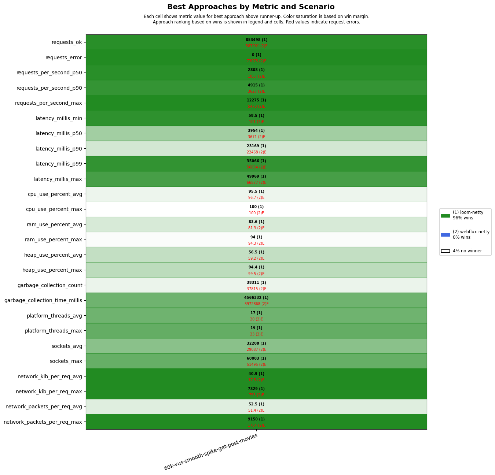

# scenarios-high-load

## Test Time

| **Name**                | **Value** |
|-------------------------|-----------|
| **Start (UTC)** | 2024-08-02 13:19:45 |
| **End (UTC)** | 2024-08-02 13:31:29 |
| **Duration (hh:mm:ss)** | 00:11:44 |

## System Specs

| **Name**                | **Value** |
|-------------------------|-----------|
| **Java** | OpenJDK 64-Bit Server VM Corretto-22.0.2.9.1 (build 22.0.2+9-FR, mixed mode, sharing) |
| **Python** | 3.12.3 |
| **OS** | Ubuntu 24.04 LTS |
| **Kernel** | 6.8.0-1010-azure |
| **CPU** | AMD EPYC 7763 64-Core Processor |
| **CPU Cores** | 4 |
| **RAM** | 15Gi total, 14Gi available |
| **Disk** | 159G total, 105G available |

## Scenarios

**Scenario file:** src/main/resources/scenarios/scenarios-high-load.csv

| Scenario | k6 Config | Server Profiles | Delay Call Depth | Delay (ms) | Connections | Requests per Second | Warmup Duration (s) | Test Duration (s) |
|----------|-----------|-----------------|------------------|------------|-------------|---------------------|---------------------|------------------|
| [60k-vus-smooth-spike-get-post-movies](#60k-vus-smooth-spike-get-post-movies) | get-post-movies-smooth-vus-spike.js |  | 0 | 100 | 60000 |  | 0 | 300 |

## Result Overview

### Overall

### Netty-based

## Result Details

### 60k-vus-smooth-spike-get-post-movies

#### loom-netty

#### webflux-netty

