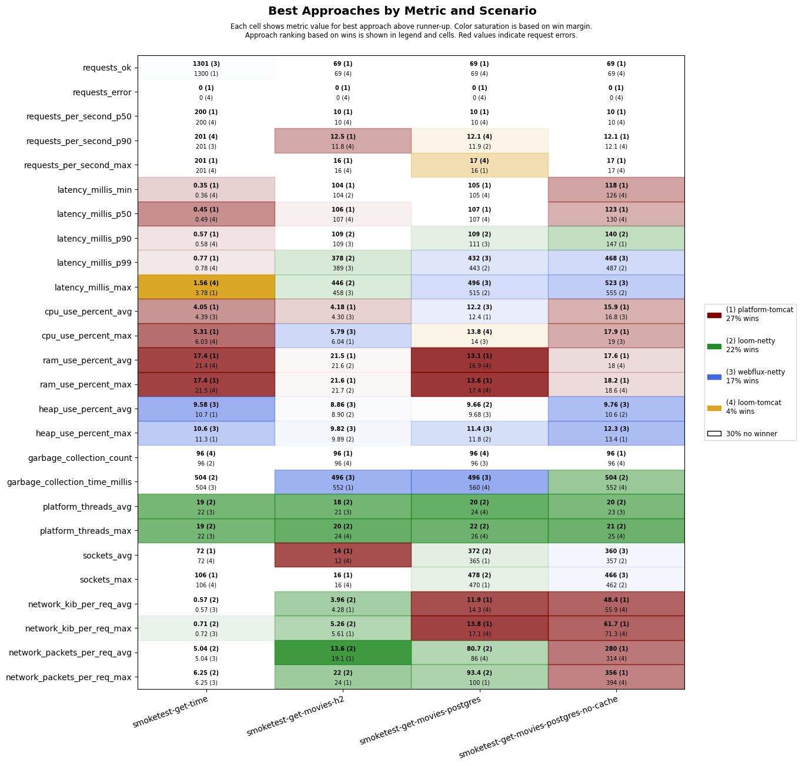
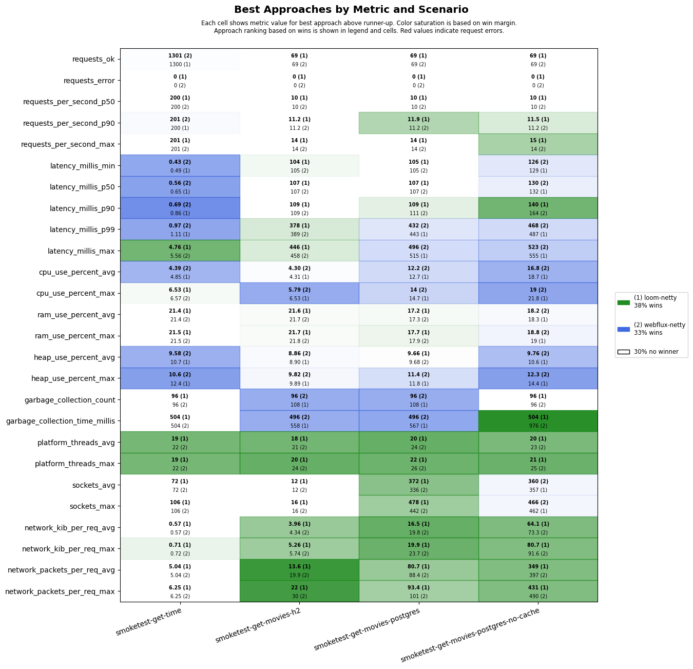

# scenarios-smoketest

## Test Time

| **Name**                | **Value** |
|-------------------------|-----------|
| **Start (UTC)** | 2025-10-06 12:02:57 |
| **End (UTC)** | 2025-10-06 12:08:32 |
| **Duration (hh:mm:ss)** | 00:05:35 |

## System Specs

| **Name**                | **Value** |
|-------------------------|-----------|
| **Java** | OpenJDK 64-Bit Server VM Corretto-25.0.0.36.2 (build 25+36-LTS, mixed mode, sharing) |
| **Spring Boot** | 3.5.6 |
| **Python** | 3.12.3 |
| **OS** | Ubuntu 24.04.3 LTS |
| **Kernel** | 6.11.0-1018-azure |
| **CPU** | AMD EPYC 7763 64-Core Processor |
| **CPU Cores** | 4 |
| **RAM** | 15Gi total, 13Gi available |
| **Disk** | 159G total, 98G available |

## Scenarios

**Scenario file:** src/main/resources/scenarios/scenarios-smoketest.csv

| Scenario | k6 Config | Server Profiles | Delay Call Depth | Delay (ms) | Connections | Requests per Second | Warmup Duration (s) | Test Duration (s) |
|----------|-----------|-----------------|------------------|------------|-------------|---------------------|---------------------|------------------|
| [smoketest-get-time](#smoketest-get-time) | get-time.js |  | 0 | 0 | 100 | 200 | 2 | 6 |
| [smoketest-get-movies-h2](#smoketest-get-movies-h2) | get-movies.js |  | 1 | 100 | 10 | 10 | 0 | 6 |
| [smoketest-get-movies-postgres](#smoketest-get-movies-postgres) | get-movies.js | postgres | 1 | 100 | 10 | 10 | 0 | 6 |
| [smoketest-get-movies-postgres-no-cache](#smoketest-get-movies-postgres-no-cache) | get-movies.js | postgres|no-cache | 1 | 100 | 10 | 10 | 0 | 6 |

## Result Overview

### Overall

### Netty-based

## Result Details

### smoketest-get-time

#### platform-tomcat

#### loom-tomcat

#### loom-netty

#### webflux-netty

### smoketest-get-movies-h2

#### platform-tomcat

#### loom-tomcat

#### loom-netty

#### webflux-netty

### smoketest-get-movies-postgres

#### platform-tomcat

#### loom-tomcat

#### loom-netty

#### webflux-netty

### smoketest-get-movies-postgres-no-cache

#### platform-tomcat

#### loom-tomcat

#### loom-netty

#### webflux-netty

