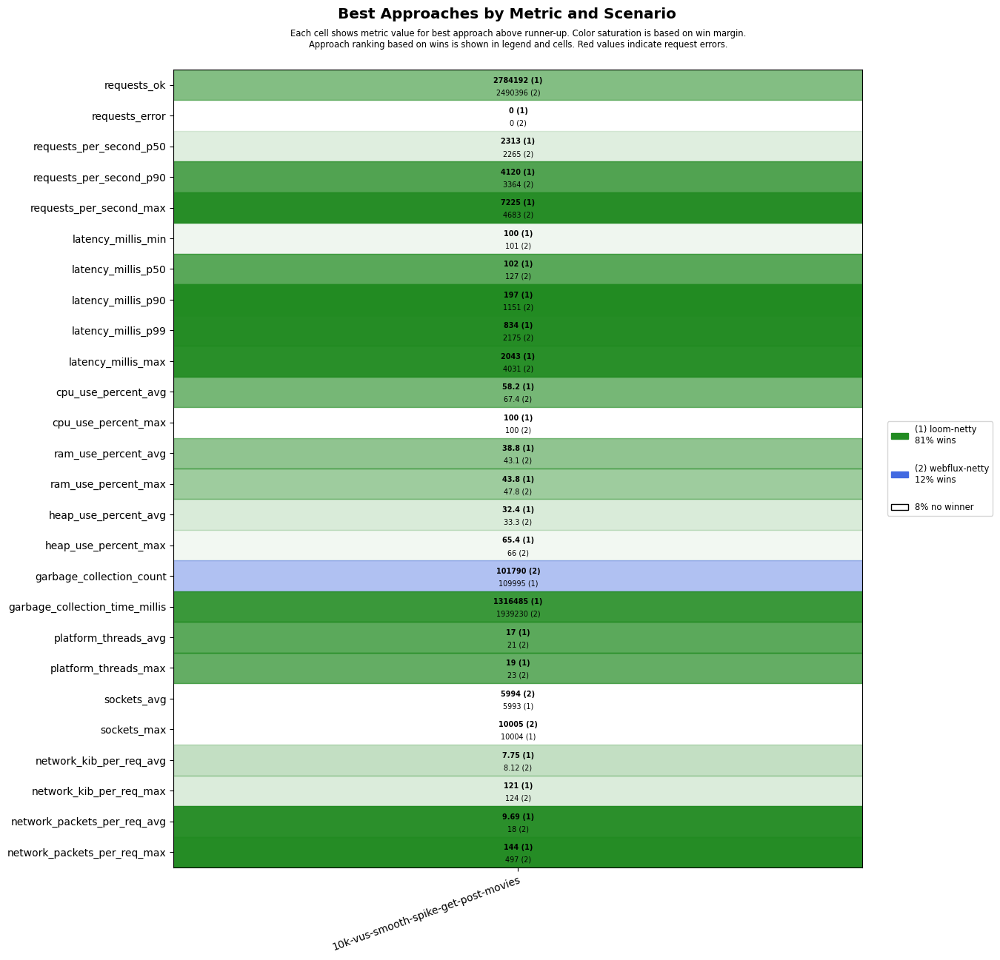
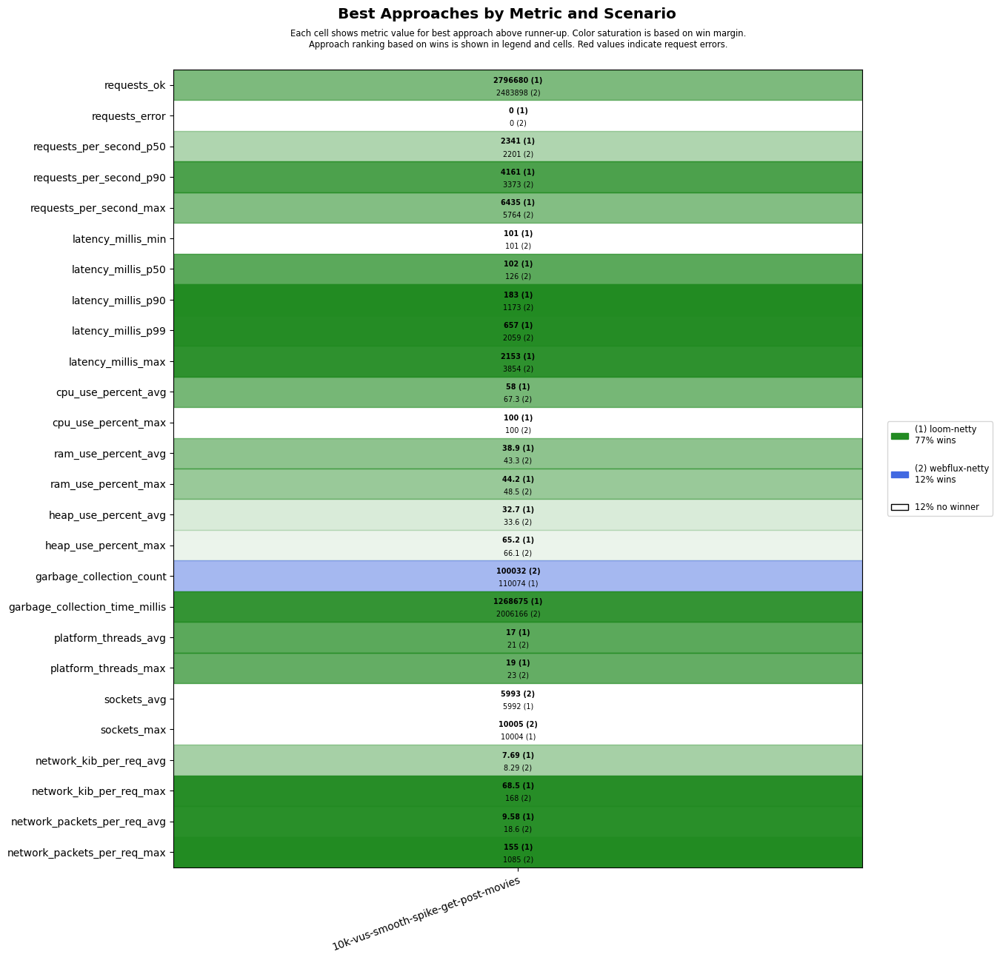

# scenarios-soaktest

## Test Time

| **Name**                | **Value** |
|-------------------------|-----------|
| **Start (UTC)** | 2025-05-02 05:25:56 |
| **End (UTC)** | 2025-05-02 06:07:47 |
| **Duration (hh:mm:ss)** | 00:41:51 |

## System Specs

| **Name**                | **Value** |
|-------------------------|-----------|
| **Java** | OpenJDK 64-Bit Server VM Corretto-21.0.7.6.1 (build 21.0.7+6-LTS, mixed mode, sharing) |
| **Spring Boot** | 3.4.5 |
| **Python** | 3.10.12 |
| **OS** | Ubuntu 22.04.5 LTS |
| **Kernel** | 6.8.0-1027-azure |
| **CPU** | AMD EPYC 7763 64-Core Processor |
| **CPU Cores** | 4 |
| **RAM** | 15Gi total, 12Gi available |
| **Disk** | 159G total, 95G available |

## Scenarios

**Scenario file:** src/main/resources/scenarios/scenarios-soaktest.csv

| Scenario | k6 Config | Server Profiles | Delay Call Depth | Delay (ms) | Connections | Requests per Second | Warmup Duration (s) | Test Duration (s) |
|----------|-----------|-----------------|------------------|------------|-------------|---------------------|---------------------|------------------|
| [10k-vus-smooth-spike-get-post-movies](#10k-vus-smooth-spike-get-post-movies) | get-post-movies-smooth-vus-spike.js |  | 0 | 100 | 10000 |  | 0 | 1200 |

## Result Overview

### Overall

### Netty-based

## Result Details

### 10k-vus-smooth-spike-get-post-movies

#### loom-netty

#### webflux-netty

