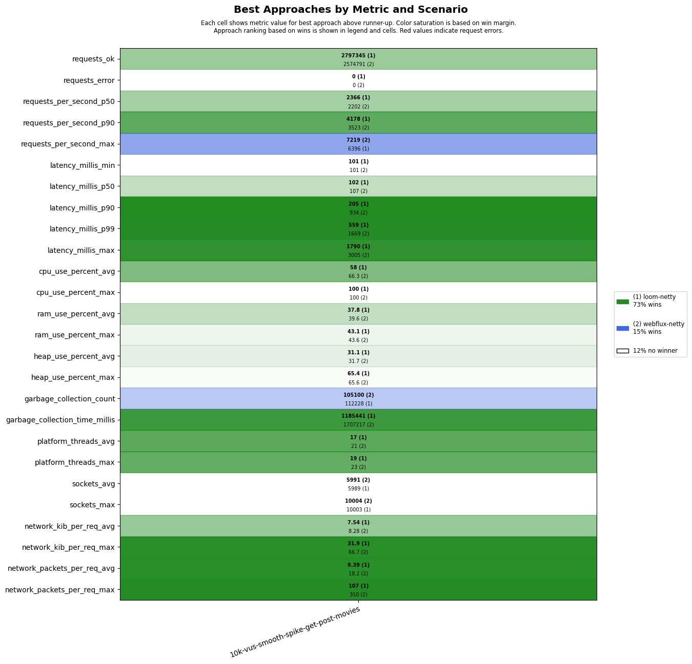

# scenarios-soaktest

## Test Time

| **Name**                | **Value** |
|-------------------------|-----------|
| **Start (UTC)** | 2024-12-02 05:25:28 |
| **End (UTC)** | 2024-12-02 06:07:16 |
| **Duration (hh:mm:ss)** | 00:41:48 |

## System Specs

| **Name**                | **Value** |
|-------------------------|-----------|
| **Java** | OpenJDK 64-Bit Server VM Corretto-23.0.1.8.1 (build 23.0.1+8-FR, mixed mode, sharing) |
| **Spring Boot** | 3.4.0 |
| **Python** | 3.12.3 |
| **OS** | Ubuntu 24.04.1 LTS |
| **Kernel** | 6.8.0-1017-azure |
| **CPU** | AMD EPYC 7763 64-Core Processor |
| **CPU Cores** | 4 |
| **RAM** | 15Gi total, 13Gi available |
| **Disk** | 159G total, 105G available |

## Scenarios

**Scenario file:** src/main/resources/scenarios/scenarios-soaktest.csv

| Scenario | k6 Config | Server Profiles | Delay Call Depth | Delay (ms) | Connections | Requests per Second | Warmup Duration (s) | Test Duration (s) |
|----------|-----------|-----------------|------------------|------------|-------------|---------------------|---------------------|------------------|
| [10k-vus-smooth-spike-get-post-movies](#10k-vus-smooth-spike-get-post-movies) | get-post-movies-smooth-vus-spike.js |  | 0 | 100 | 10000 |  | 0 | 1200 |

## Result Overview

### Overall

### Netty-based

## Result Details

### 10k-vus-smooth-spike-get-post-movies

#### loom-netty

#### webflux-netty

