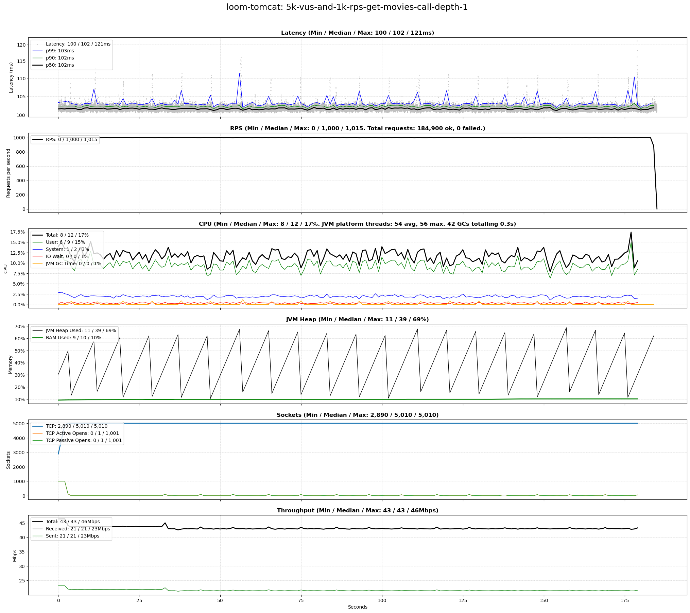
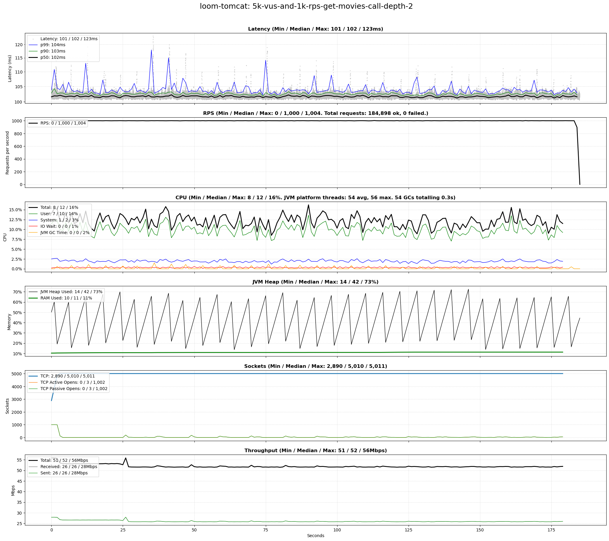
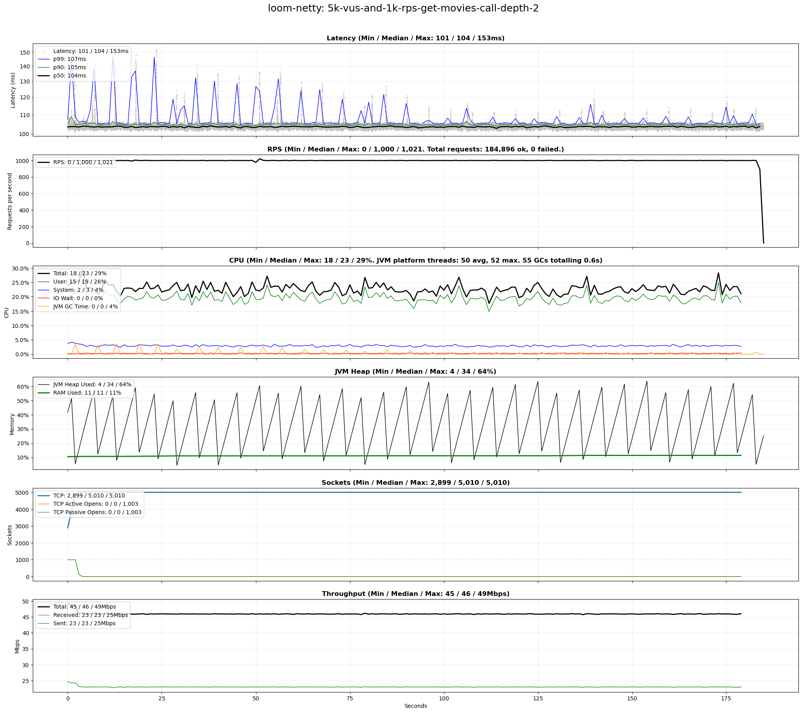
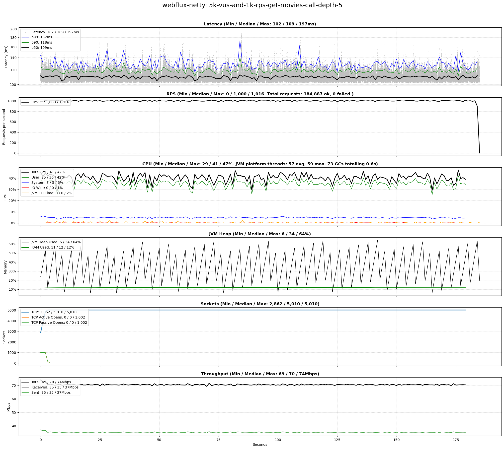
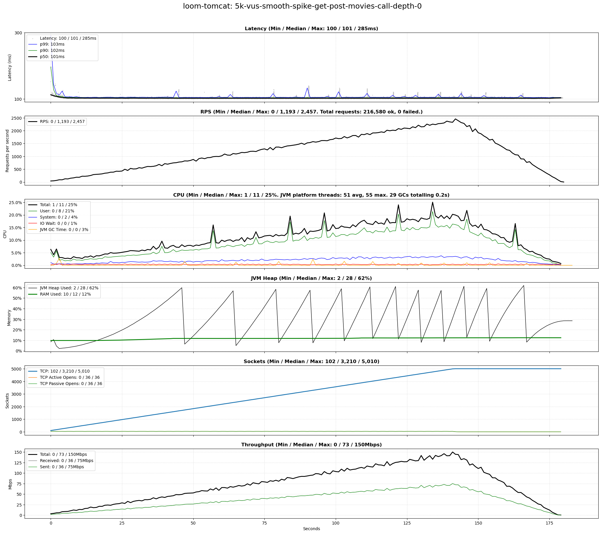
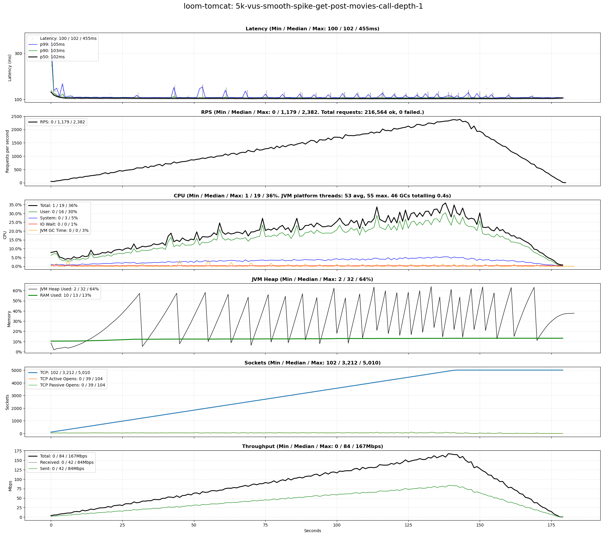
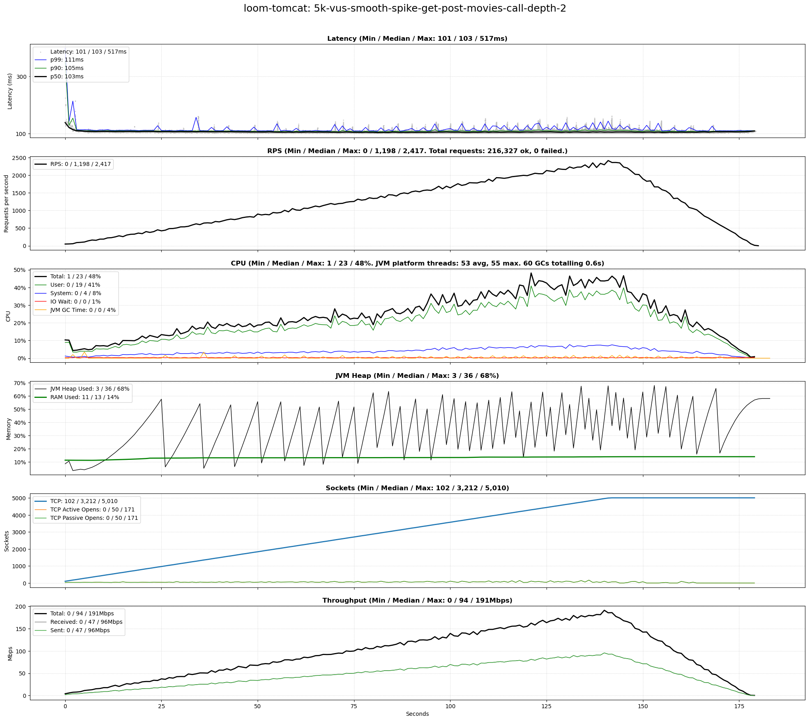

# scenarios-deep-call-stack

## Test Time

| **Name**                | **Value** |
|-------------------------|-----------|
| **Start (UTC)** | 2024-09-02 08:24:59 |
| **End (UTC)** | 2024-09-02 09:48:05 |
| **Duration (hh:mm:ss)** | 01:23:06 |

## System Specs

| **Name**                | **Value** |
|-------------------------|-----------|
| **Java** | OpenJDK 64-Bit Server VM Corretto-21.0.4.7.1 (build 21.0.4+7-LTS, mixed mode, sharing) |
| **Python** | 3.12.3 |
| **OS** | Ubuntu 24.04.1 LTS |
| **Kernel** | 6.8.0-41-generic |
| **CPU** | Intel(R) Core(TM) i7-6700K CPU @ 4.00GHz |
| **CPU Cores** | 8 |
| **RAM** | 31Gi total, 24Gi available |
| **Disk** | 506G total, 290G available |

## Scenarios

**Scenario file:** src/main/resources/scenarios/scenarios-deep-call-stack.csv

| Scenario | k6 Config | Server Profiles | Delay Call Depth | Delay (ms) | Connections | Requests per Second | Warmup Duration (s) | Test Duration (s) |
|----------|-----------|-----------------|------------------|------------|-------------|---------------------|---------------------|------------------|
| [5k-vus-and-1k-rps-get-movies-call-depth-0](#5k-vus-and-1k-rps-get-movies-call-depth-0) | get-movies.js |  | 0 | 100 | 5000 | 1000 | 10 | 180 |
| [5k-vus-and-1k-rps-get-movies-call-depth-1](#5k-vus-and-1k-rps-get-movies-call-depth-1) | get-movies.js |  | 1 | 100 | 5000 | 1000 | 10 | 180 |
| [5k-vus-and-1k-rps-get-movies-call-depth-2](#5k-vus-and-1k-rps-get-movies-call-depth-2) | get-movies.js |  | 2 | 100 | 5000 | 1000 | 10 | 180 |
| [5k-vus-and-1k-rps-get-movies-call-depth-5](#5k-vus-and-1k-rps-get-movies-call-depth-5) | get-movies.js |  | 5 | 100 | 5000 | 1000 | 10 | 180 |
| [5k-vus-smooth-spike-get-post-movies-call-depth-0](#5k-vus-smooth-spike-get-post-movies-call-depth-0) | get-post-movies-smooth-vus-spike.js |  | 0 | 100 | 5000 |  | 0 | 180 |
| [5k-vus-smooth-spike-get-post-movies-call-depth-1](#5k-vus-smooth-spike-get-post-movies-call-depth-1) | get-post-movies-smooth-vus-spike.js |  | 1 | 100 | 5000 |  | 0 | 180 |
| [5k-vus-smooth-spike-get-post-movies-call-depth-2](#5k-vus-smooth-spike-get-post-movies-call-depth-2) | get-post-movies-smooth-vus-spike.js |  | 2 | 100 | 5000 |  | 0 | 180 |
| [5k-vus-smooth-spike-get-post-movies-call-depth-5](#5k-vus-smooth-spike-get-post-movies-call-depth-5) | get-post-movies-smooth-vus-spike.js |  | 5 | 100 | 5000 |  | 0 | 180 |

## Result Overview

### Overall

### Netty-based

## Result Details

### 5k-vus-and-1k-rps-get-movies-call-depth-0

#### loom-tomcat

#### loom-netty

#### webflux-netty

### 5k-vus-and-1k-rps-get-movies-call-depth-1

#### loom-tomcat

#### loom-netty

#### webflux-netty

### 5k-vus-and-1k-rps-get-movies-call-depth-2

#### loom-tomcat

#### loom-netty

#### webflux-netty

### 5k-vus-and-1k-rps-get-movies-call-depth-5

#### loom-tomcat

#### loom-netty

#### webflux-netty

### 5k-vus-smooth-spike-get-post-movies-call-depth-0

#### loom-tomcat

#### loom-netty

#### webflux-netty

### 5k-vus-smooth-spike-get-post-movies-call-depth-1

#### loom-tomcat

#### loom-netty

#### webflux-netty

### 5k-vus-smooth-spike-get-post-movies-call-depth-2

#### loom-tomcat

#### loom-netty

#### webflux-netty

### 5k-vus-smooth-spike-get-post-movies-call-depth-5

#### loom-tomcat

#### loom-netty

#### webflux-netty

