# scenarios-default

## Test Time

| **Name**                | **Value** |
|-------------------------|-----------|
| **Start (UTC)** | 2024-07-27 10:58:04 |
| **End (UTC)** | 2024-07-27 12:47:11 |
| **Duration (hh:mm:ss)** | 01:49:07 |

## System Specs

| **Name**                | **Value** |
|-------------------------|-----------|
| **Java** | OpenJDK 64-Bit Server VM Corretto-21.0.4.7.1 (build 21.0.4+7-LTS, mixed mode, sharing) |
| **Python** | 3.10.12 |
| **OS** | Ubuntu 22.04.4 LTS |
| **Kernel** | 6.5.0-45-generic |
| **CPU** | Intel(R) Core(TM) i7-6700K CPU @ 4.00GHz |
| **CPU Cores** | 8 |
| **RAM** | 31Gi total, 27Gi available |
| **Disk** | 506G total, 286G available |

## Scenarios

**Scenario file:** src/main/resources/scenarios/scenarios-default.csv

| Scenario | k6 Config | Server Profiles | Delay Call Depth | Delay (ms) | Connections | Requests per Second | Warmup Duration (s) | Test Duration (s) |
|----------|-----------|-----------------|------------------|------------|-------------|---------------------|---------------------|------------------|
| [smoketest](#smoketest) | get-time.js |  | 1 | 100 | 5 | 5 | 0 | 5 |
| [1k-vus-and-rps-get-time-no-delay](#1k-vus-and-rps-get-time-no-delay) | get-time.js |  | 0 | 0 | 1000 | 1000 | 10 | 180 |
| [5k-vus-and-rps-get-time](#5k-vus-and-rps-get-time) | get-time.js |  | 0 | 100 | 5000 | 5000 | 10 | 180 |
| [5k-vus-and-rps-get-movies](#5k-vus-and-rps-get-movies) | get-movies.js |  | 0 | 100 | 5000 | 5000 | 10 | 180 |
| [10k-vus-and-rps-get-movies](#10k-vus-and-rps-get-movies) | get-movies.js |  | 0 | 100 | 10000 | 10000 | 10 | 180 |
| [10k-vus-and-rps-get-movies-call-depth-1](#10k-vus-and-rps-get-movies-call-depth-1) | get-movies.js |  | 1 | 100 | 10000 | 10000 | 10 | 180 |
| [20k-vus-stepped-spike-get-movies](#20k-vus-stepped-spike-get-movies) | get-movies-stepped-vus-spike.js |  | 0 | 100 | 20000 |  | 0 | 180 |
| [20k-vus-smooth-spike-get-movies](#20k-vus-smooth-spike-get-movies) | get-movies-smooth-vus-spike.js |  | 0 | 100 | 20000 |  | 0 | 180 |
| [20k-vus-smooth-spike-get-post-movies](#20k-vus-smooth-spike-get-post-movies) | get-post-movies-smooth-vus-spike.js |  | 0 | 100 | 20000 |  | 0 | 180 |
| [20k-vus-smooth-spike-get-post-movies-call-depth-1](#20k-vus-smooth-spike-get-post-movies-call-depth-1) | get-post-movies-smooth-vus-spike.js |  | 1 | 100 | 20000 |  | 0 | 180 |
| [20k-vus-smooth-spike-get-post-movies-call-depth-2](#20k-vus-smooth-spike-get-post-movies-call-depth-2) | get-post-movies-smooth-vus-spike.js |  | 2 | 100 | 20000 |  | 0 | 180 |

## Result Overview

### Overall

### Netty-based

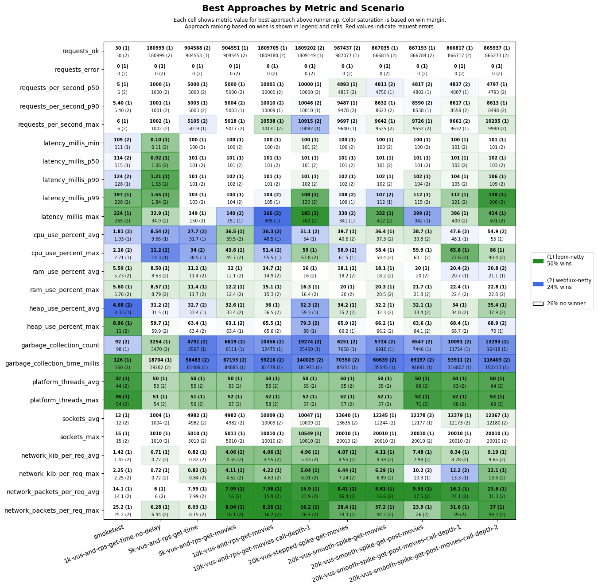

## Result Details

### smoketest

#### loom-tomcat

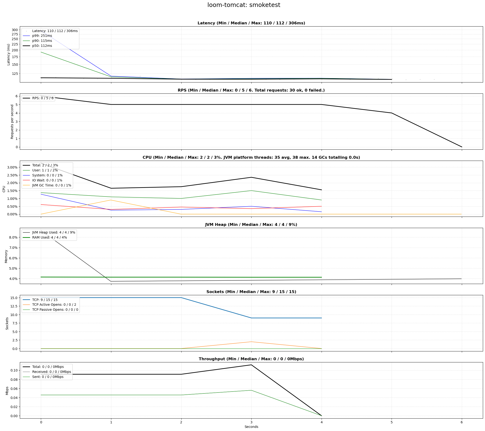

#### loom-netty

#### webflux-netty

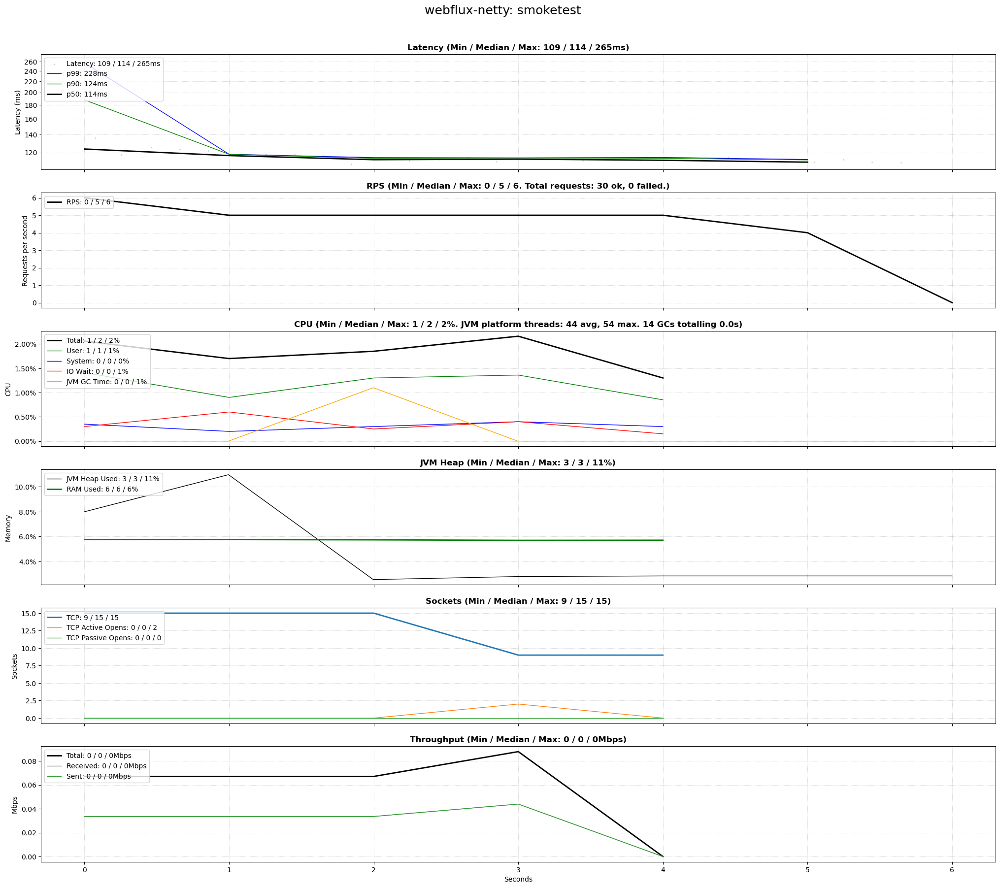

### 1k-vus-and-rps-get-time-no-delay

#### loom-tomcat

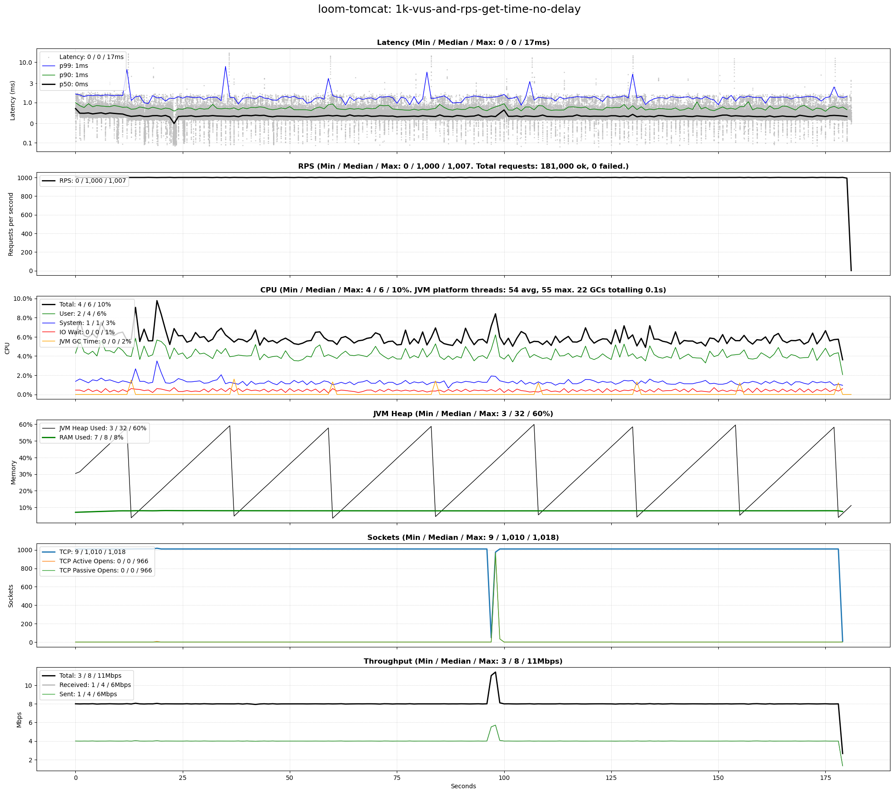

#### loom-netty

#### webflux-netty

### 5k-vus-and-rps-get-time

#### loom-tomcat

#### loom-netty

#### webflux-netty

### 5k-vus-and-rps-get-movies

#### loom-tomcat

#### loom-netty

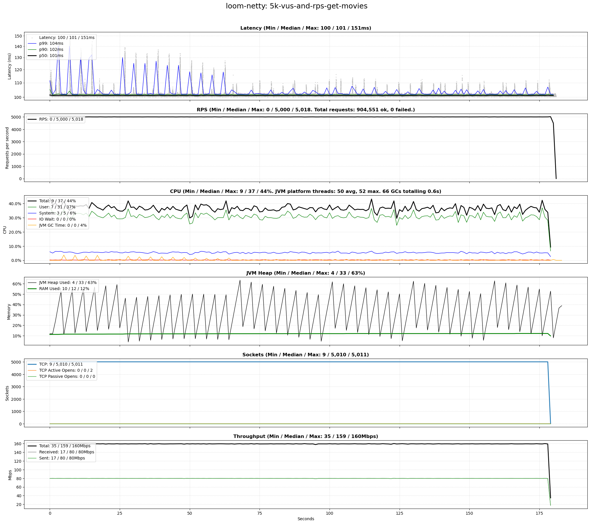

#### webflux-netty

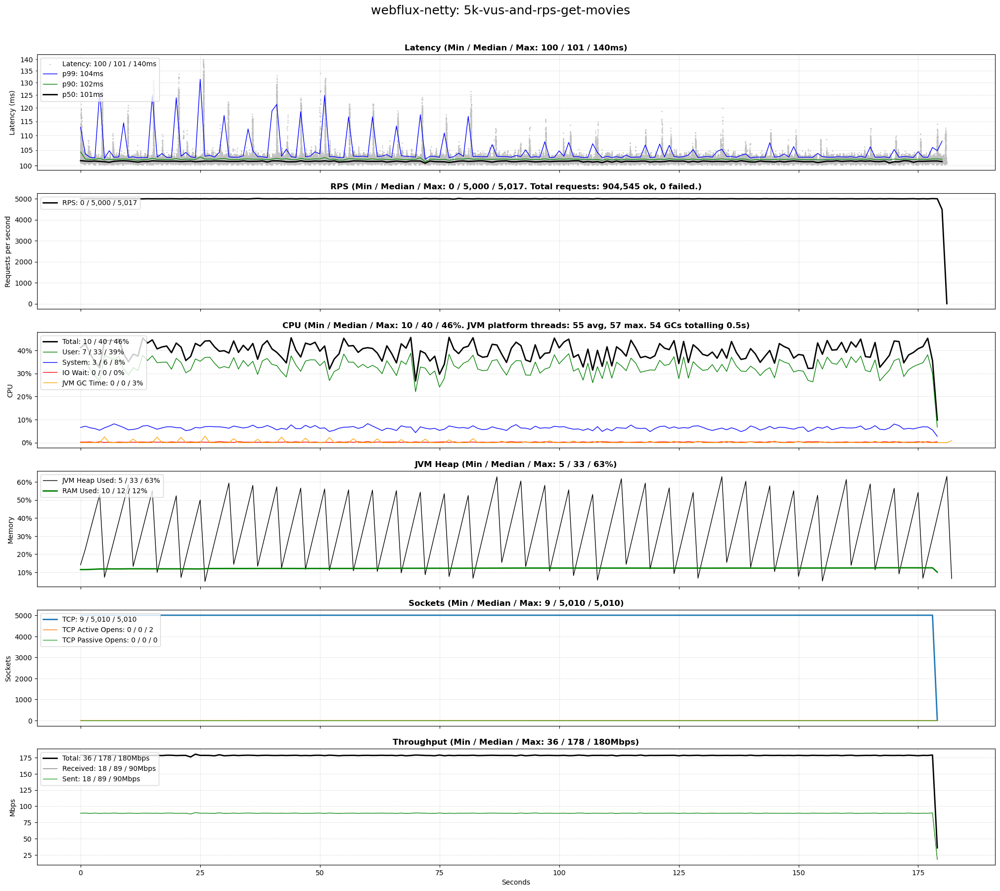

### 10k-vus-and-rps-get-movies

#### loom-tomcat

#### loom-netty

#### webflux-netty

### 10k-vus-and-rps-get-movies-call-depth-1

#### loom-tomcat

#### loom-netty

#### webflux-netty

### 20k-vus-stepped-spike-get-movies

#### loom-tomcat

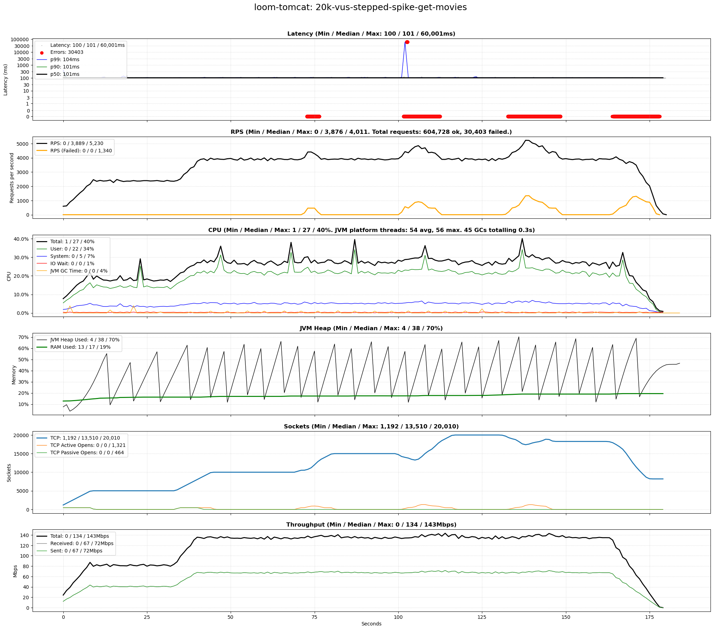

#### loom-netty

#### webflux-netty

### 20k-vus-smooth-spike-get-movies

#### loom-tomcat

#### loom-netty

#### webflux-netty

### 20k-vus-smooth-spike-get-post-movies

#### loom-tomcat

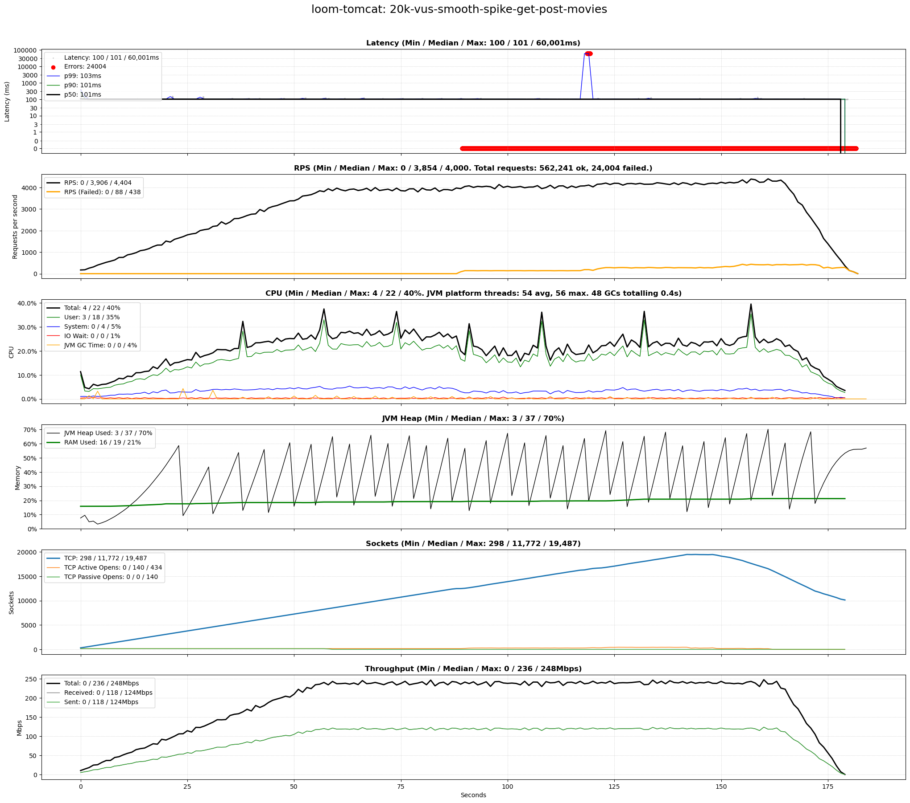

#### loom-netty

#### webflux-netty

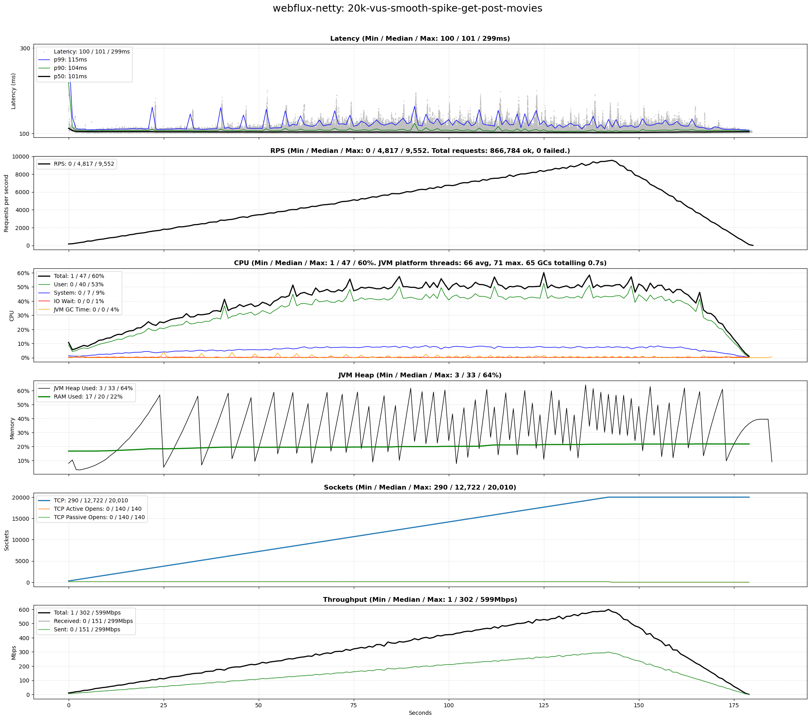

### 20k-vus-smooth-spike-get-post-movies-call-depth-1

#### loom-tomcat

#### loom-netty

#### webflux-netty

### 20k-vus-smooth-spike-get-post-movies-call-depth-2

#### loom-tomcat

#### loom-netty

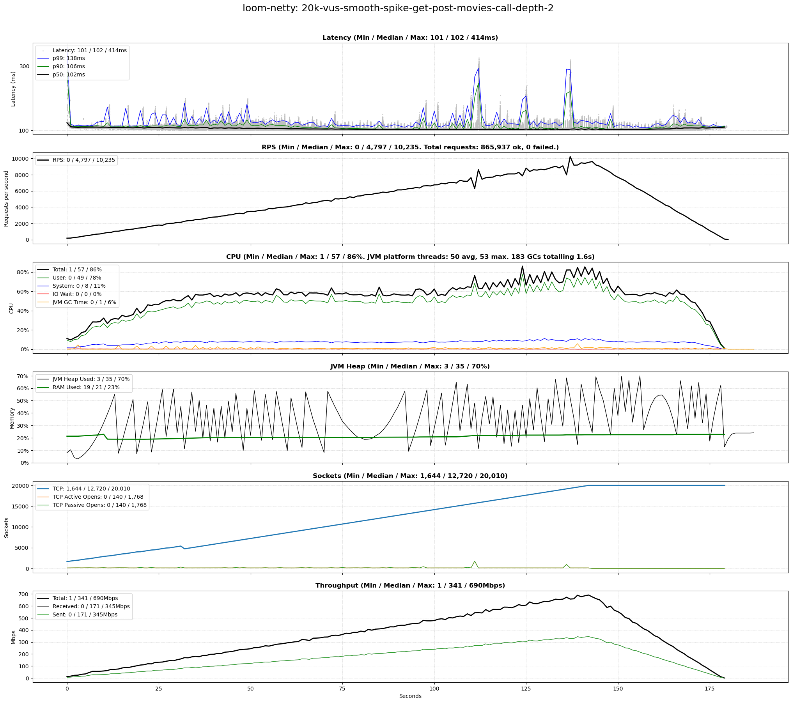

#### webflux-netty

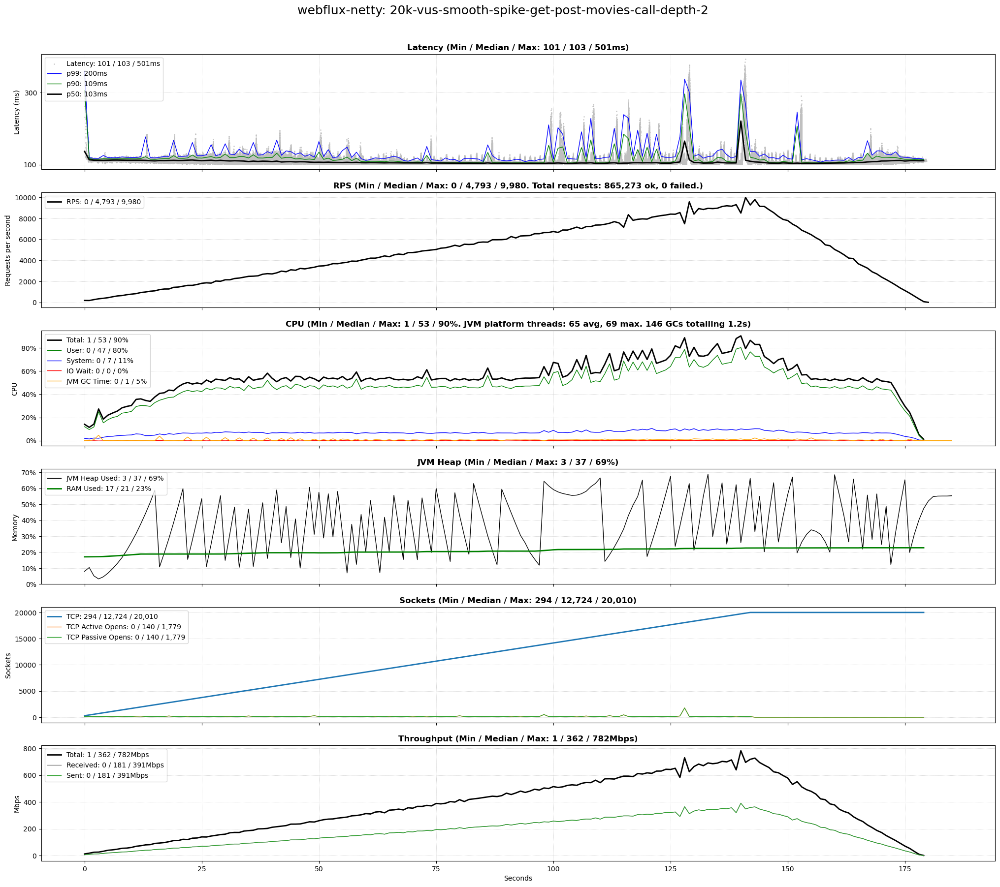

