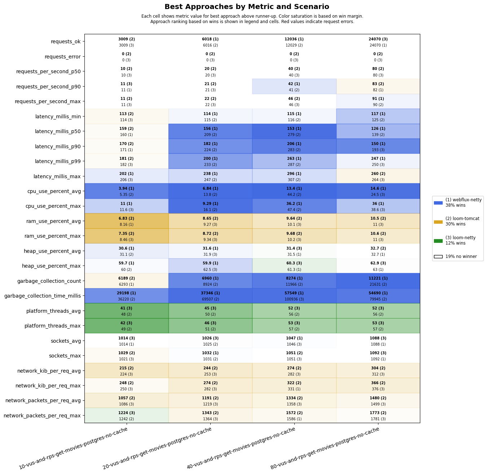
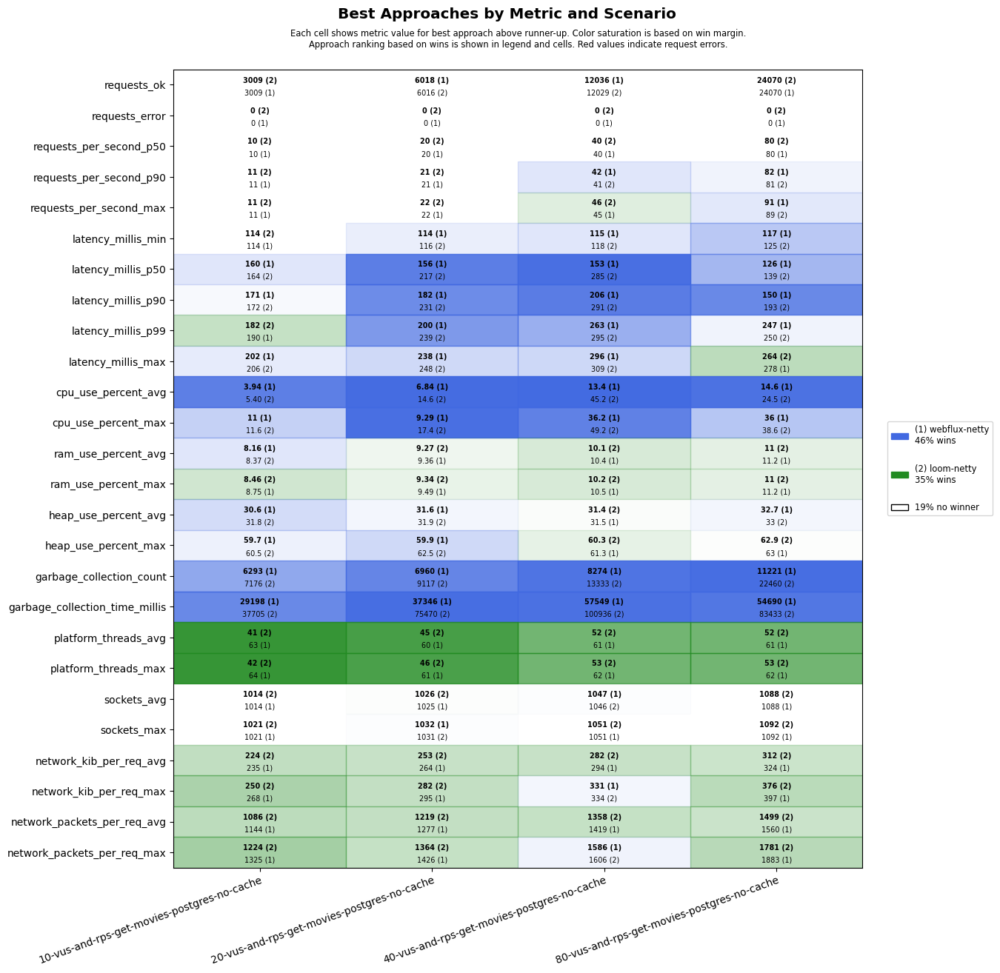
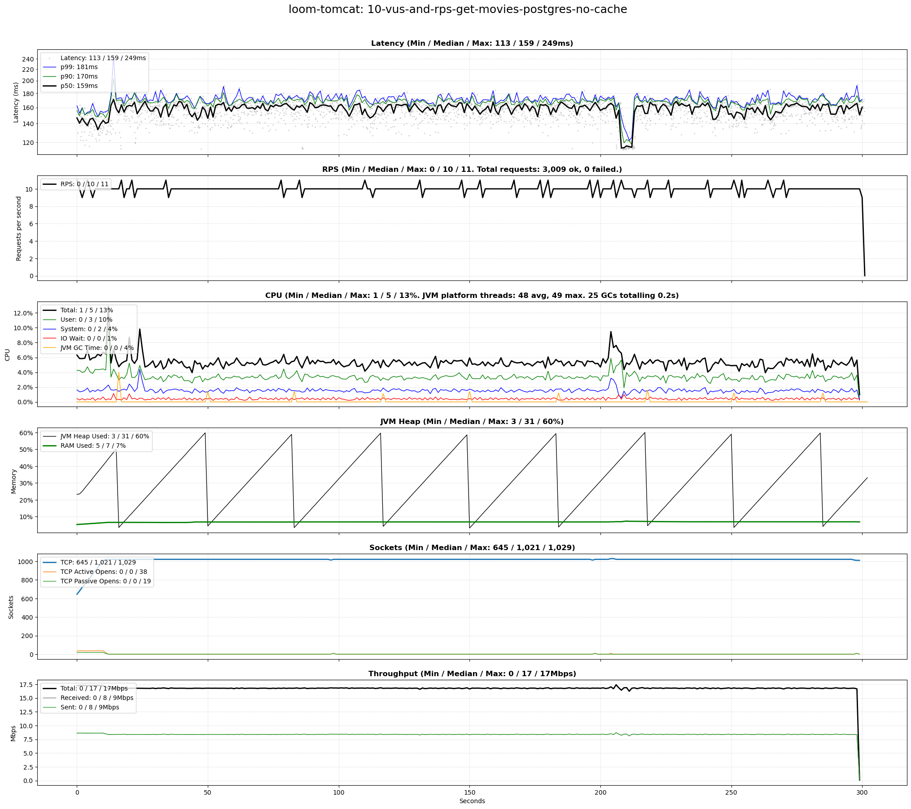
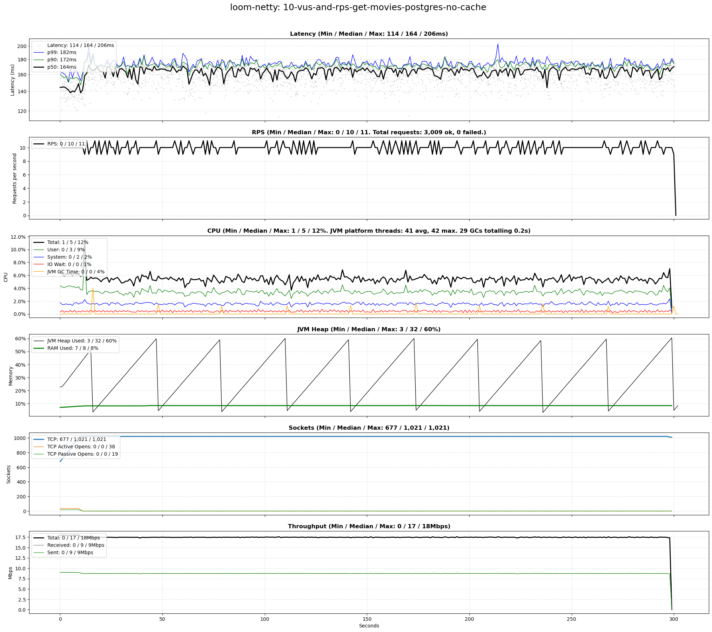

# scenarios-postgres

## Test Time

| **Name**                | **Value** |
|-------------------------|-----------|
| **Start (UTC)** | 2024-07-27 00:28:24 |
| **End (UTC)** | 2024-07-27 01:24:03 |
| **Duration (hh:mm:ss)** | 00:55:39 |

## System Specs

| **Name**                | **Value** |
|-------------------------|-----------|
| **Java** | OpenJDK 64-Bit Server VM Corretto-21.0.4.7.1 (build 21.0.4+7-LTS, mixed mode, sharing) |
| **Python** | 3.10.12 |
| **OS** | Ubuntu 22.04.4 LTS |
| **Kernel** | 6.5.0-45-generic |
| **CPU** | Intel(R) Core(TM) i7-6700K CPU @ 4.00GHz |
| **CPU Cores** | 8 |
| **RAM** | 31Gi total, 27Gi available |
| **Disk** | 506G total, 287G available |

## Scenarios

**Scenario file:** src/main/resources/scenarios/scenarios-postgres.csv

| Scenario | k6 Config | Server Profiles | Delay Call Depth | Delay (ms) | Connections | Requests per Second | Warmup Duration (s) | Test Duration (s) |
|----------|-----------|-----------------|------------------|------------|-------------|---------------------|---------------------|------------------|
| [10-vus-and-rps-get-movies-postgres-no-cache](#10-vus-and-rps-get-movies-postgres-no-cache) | get-movies.js | postgres|no-cache | 0 | 100 | 10 | 10 | 0 | 120 |
| [50-vus-and-rps-get-movies-postgres-no-cache](#50-vus-and-rps-get-movies-postgres-no-cache) | get-movies.js | postgres|no-cache | 0 | 100 | 50 | 50 | 0 | 120 |
| [100-vus-and-rps-get-movies-postgres-no-cache](#100-vus-and-rps-get-movies-postgres-no-cache) | get-movies.js | postgres|no-cache | 0 | 100 | 100 | 100 | 0 | 120 |
| [200-vus-and-rps-get-movies-postgres-no-cache](#200-vus-and-rps-get-movies-postgres-no-cache) | get-movies.js | postgres|no-cache | 0 | 100 | 200 | 200 | 0 | 120 |
| [300-vus-and-rps-get-movies-postgres-no-cache](#300-vus-and-rps-get-movies-postgres-no-cache) | get-movies.js | postgres|no-cache | 0 | 100 | 300 | 300 | 0 | 120 |
| [400-vus-and-rps-get-movies-postgres-no-cache](#400-vus-and-rps-get-movies-postgres-no-cache) | get-movies.js | postgres|no-cache | 0 | 100 | 400 | 400 | 0 | 120 |
| [500-vus-and-rps-get-movies-postgres-no-cache](#500-vus-and-rps-get-movies-postgres-no-cache) | get-movies.js | postgres|no-cache | 0 | 100 | 500 | 500 | 0 | 120 |

## Result Overview

### Overall

### Netty-based

## Result Details

### 10-vus-and-rps-get-movies-postgres-no-cache

#### loom-tomcat

#### loom-netty

#### webflux-netty

### 50-vus-and-rps-get-movies-postgres-no-cache

#### loom-tomcat

#### loom-netty

#### webflux-netty

### 100-vus-and-rps-get-movies-postgres-no-cache

#### loom-tomcat

#### loom-netty

#### webflux-netty

### 200-vus-and-rps-get-movies-postgres-no-cache

#### loom-tomcat

#### loom-netty

#### webflux-netty

### 300-vus-and-rps-get-movies-postgres-no-cache

#### loom-tomcat

#### loom-netty

#### webflux-netty

### 400-vus-and-rps-get-movies-postgres-no-cache

#### loom-tomcat

#### loom-netty

#### webflux-netty

### 500-vus-and-rps-get-movies-postgres-no-cache

#### loom-tomcat

#### loom-netty

#### webflux-netty

