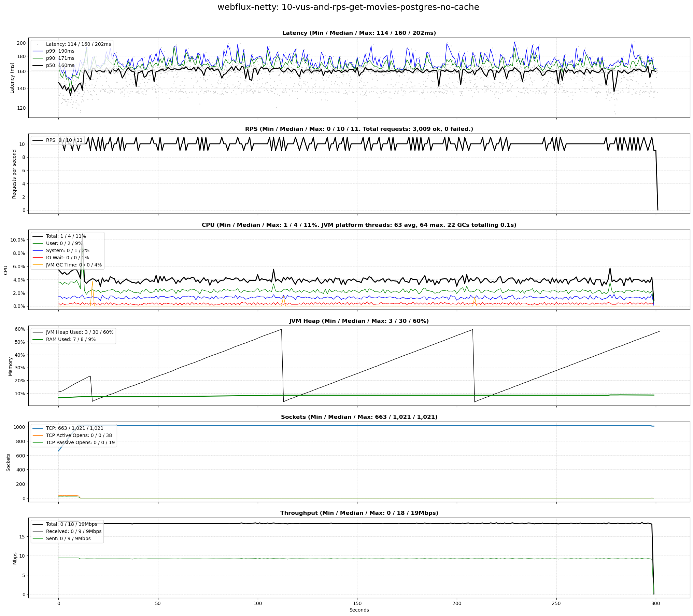
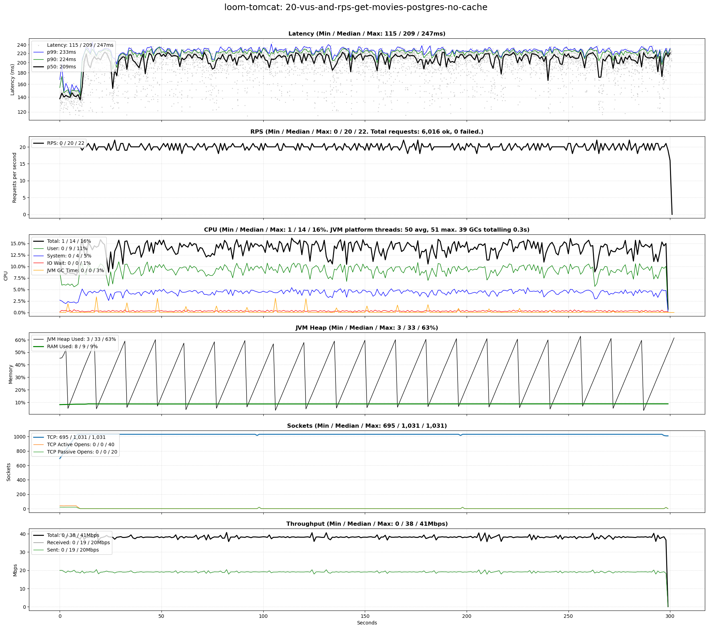
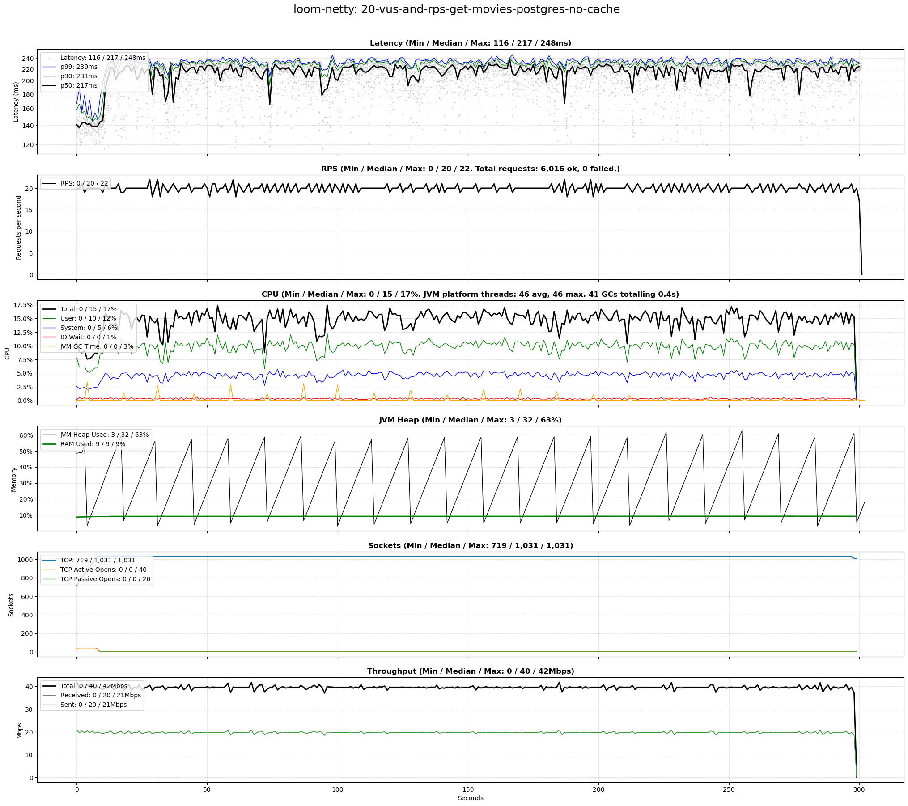
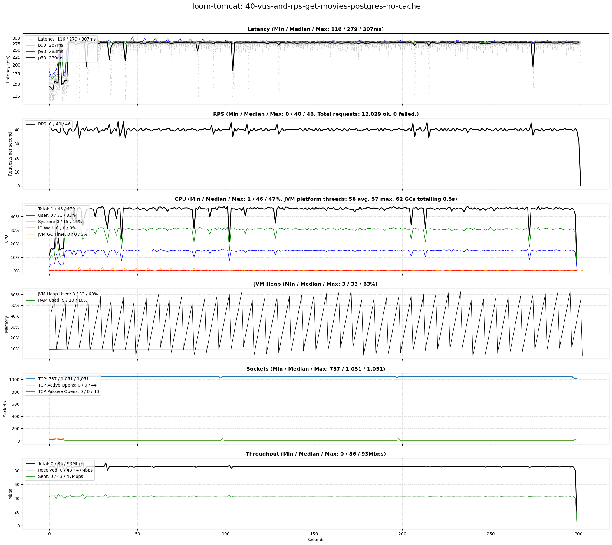
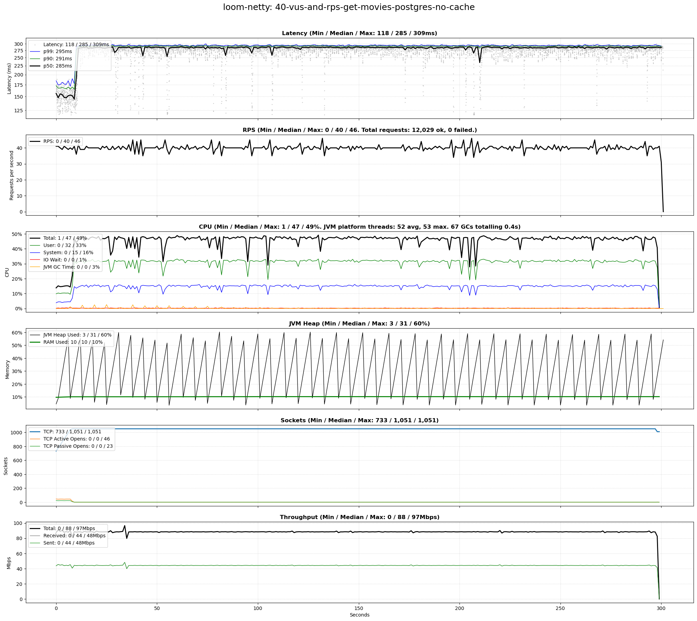
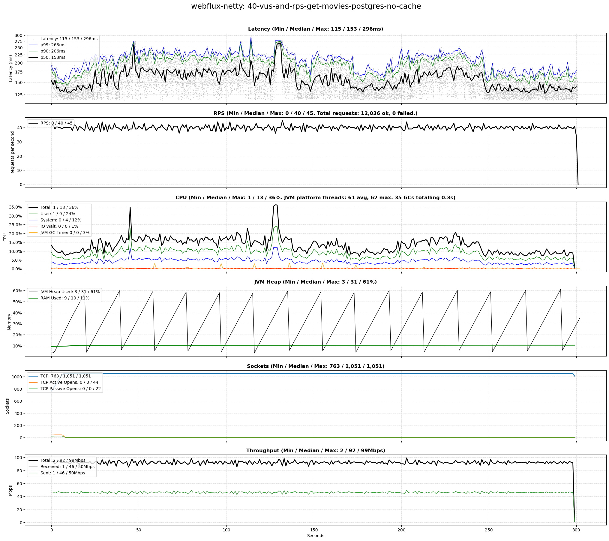
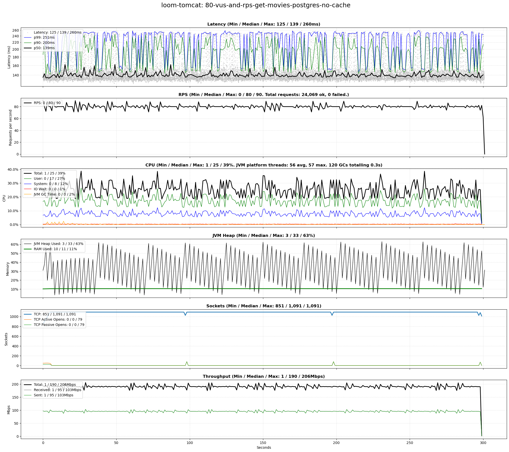
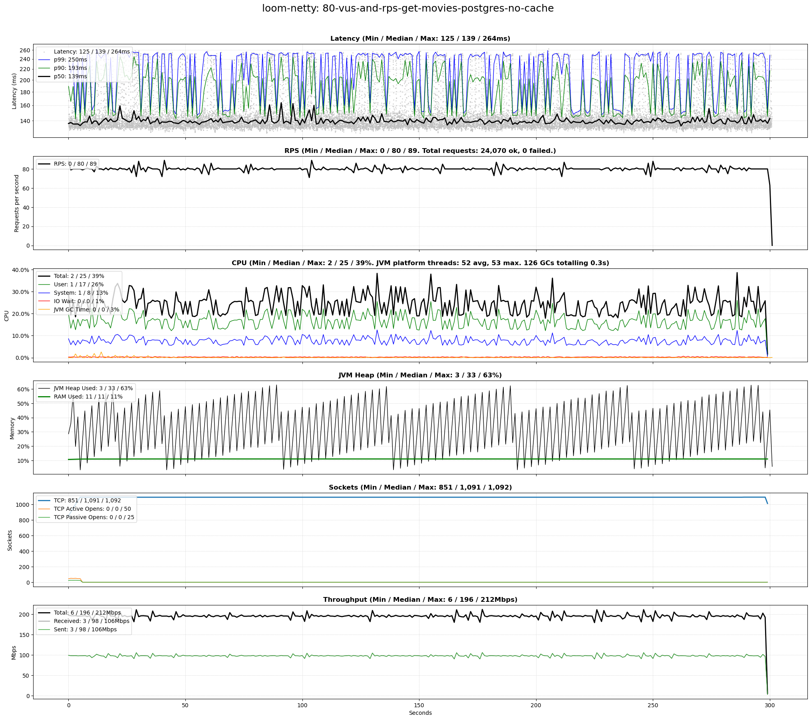

# scenarios-postgres

## Test Time

| **Name**                | **Value** |
|-------------------------|-----------|
| **Start (UTC)** | 2025-02-09 22:38:51 |
| **End (UTC)** | 2025-02-09 23:43:59 |
| **Duration (hh:mm:ss)** | 01:05:08 |

## System Specs

| **Name**                | **Value** |
|-------------------------|-----------|
| **Java** | OpenJDK 64-Bit Server VM Corretto-21.0.6.7.1 (build 21.0.6+7-LTS, mixed mode, sharing) |
| **Spring Boot** | 3.4.2 |
| **Python** | 3.12.3 |
| **OS** | Ubuntu 24.04.1 LTS |
| **Kernel** | 6.8.0-52-generic |
| **CPU** | Intel(R) Core(TM) i5-14600K |
| **CPU Cores** | 20 |
| **RAM** | 62Gi total, 54Gi available |
| **Disk** | 544G total, 310G available |

## Scenarios

**Scenario file:** src/main/resources/scenarios/scenarios-postgres.csv

| Scenario | k6 Config | Server Profiles | Delay Call Depth | Delay (ms) | Connections | Requests per Second | Warmup Duration (s) | Test Duration (s) |
|----------|-----------|-----------------|------------------|------------|-------------|---------------------|---------------------|------------------|
| [10-vus-and-rps-get-movies-postgres-no-cache](#10-vus-and-rps-get-movies-postgres-no-cache) | get-movies.js | postgres|no-cache | 0 | 100 | 10 | 10 | 10 | 300 |
| [20-vus-and-rps-get-movies-postgres-no-cache](#20-vus-and-rps-get-movies-postgres-no-cache) | get-movies.js | postgres|no-cache | 0 | 100 | 20 | 20 | 10 | 300 |
| [40-vus-and-rps-get-movies-postgres-no-cache](#40-vus-and-rps-get-movies-postgres-no-cache) | get-movies.js | postgres|no-cache | 0 | 100 | 40 | 40 | 10 | 300 |
| [80-vus-and-rps-get-movies-postgres-no-cache](#80-vus-and-rps-get-movies-postgres-no-cache) | get-movies.js | postgres|no-cache | 0 | 100 | 80 | 80 | 10 | 300 |

## Result Overview

### Overall

### Netty-based

## Result Details

### 10-vus-and-rps-get-movies-postgres-no-cache

#### loom-tomcat

#### loom-netty

#### webflux-netty

### 20-vus-and-rps-get-movies-postgres-no-cache

#### loom-tomcat

#### loom-netty

#### webflux-netty

### 40-vus-and-rps-get-movies-postgres-no-cache

#### loom-tomcat

#### loom-netty

#### webflux-netty

### 80-vus-and-rps-get-movies-postgres-no-cache

#### loom-tomcat

#### loom-netty

#### webflux-netty

