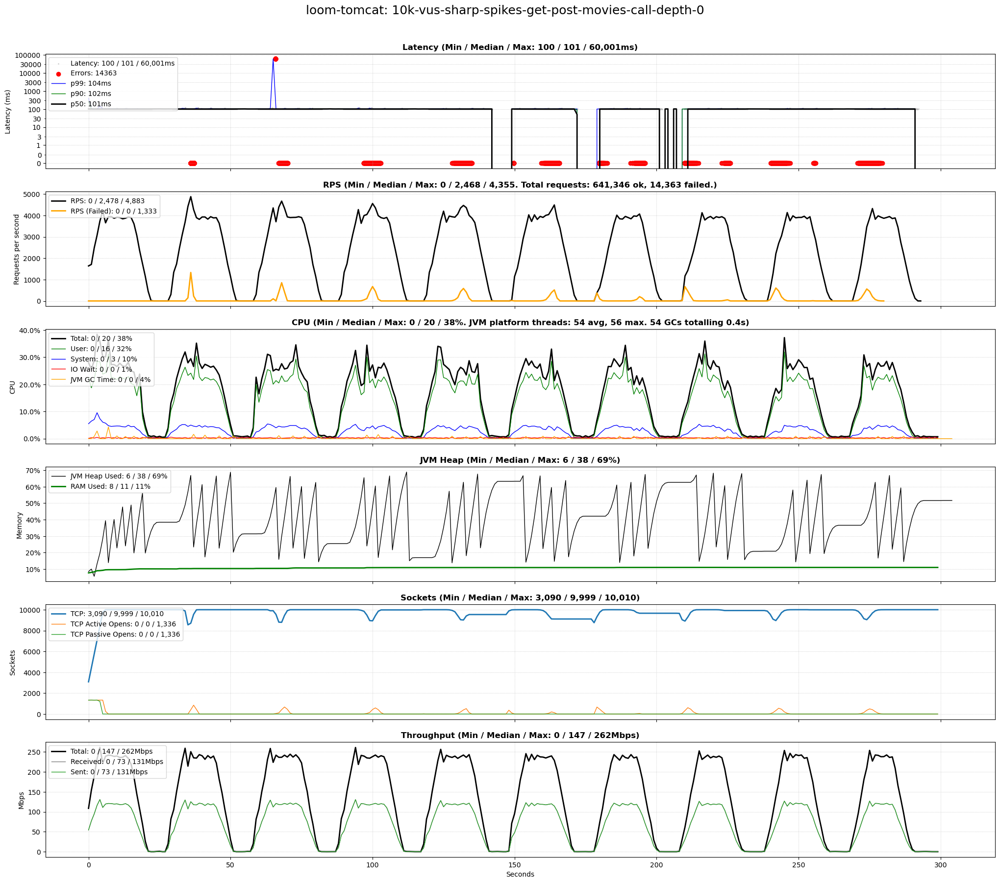
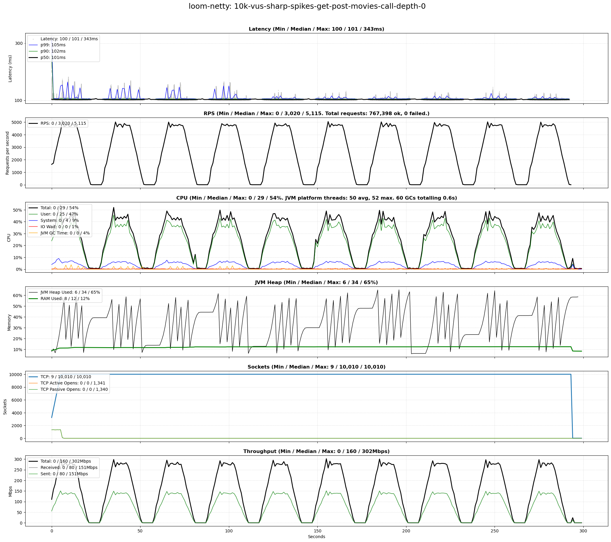
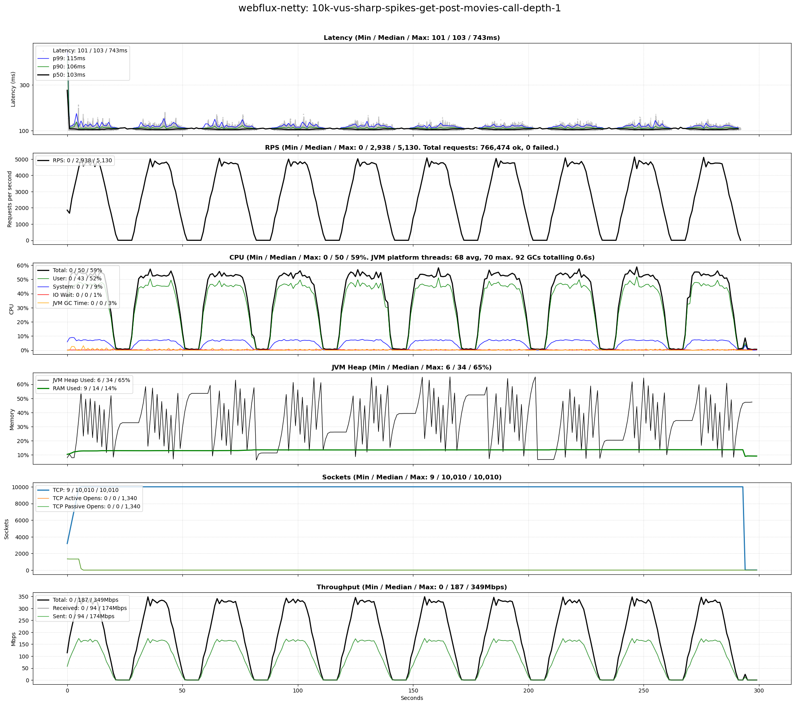
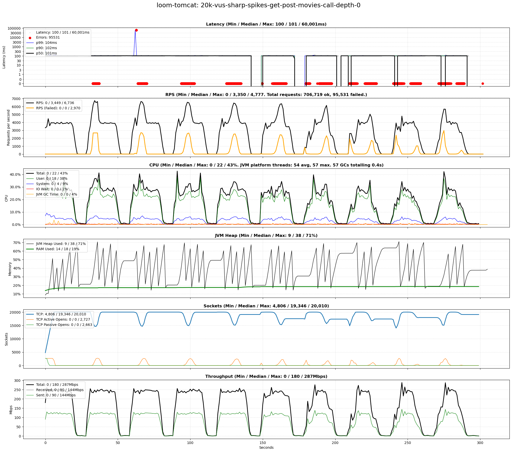
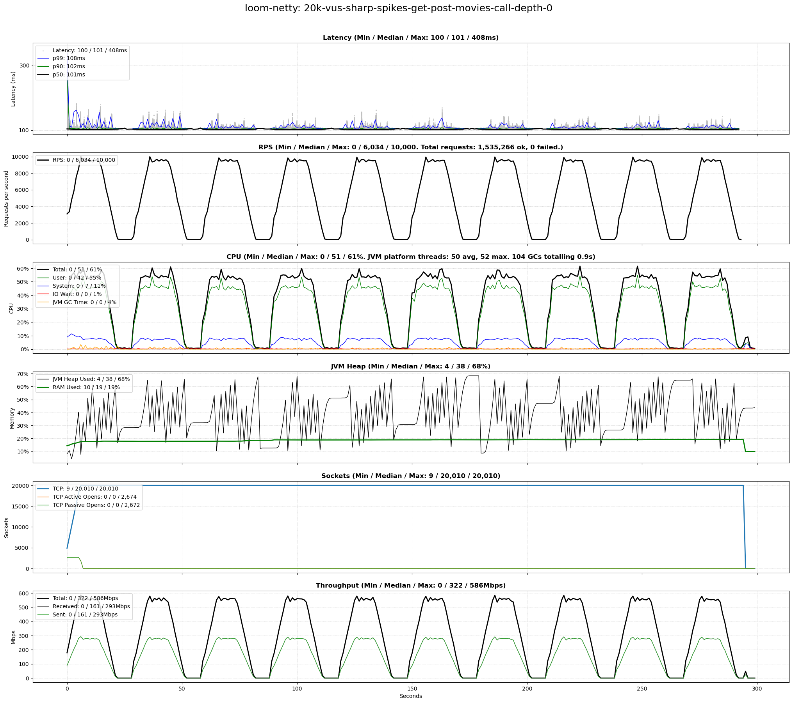
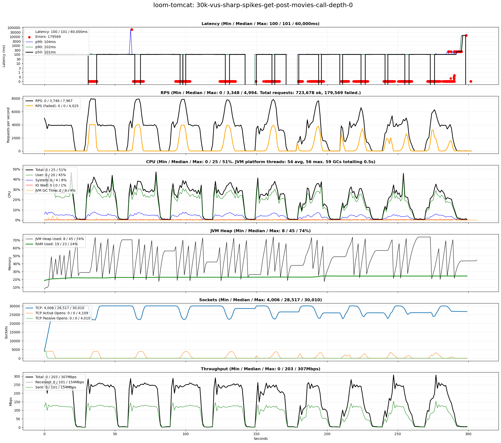
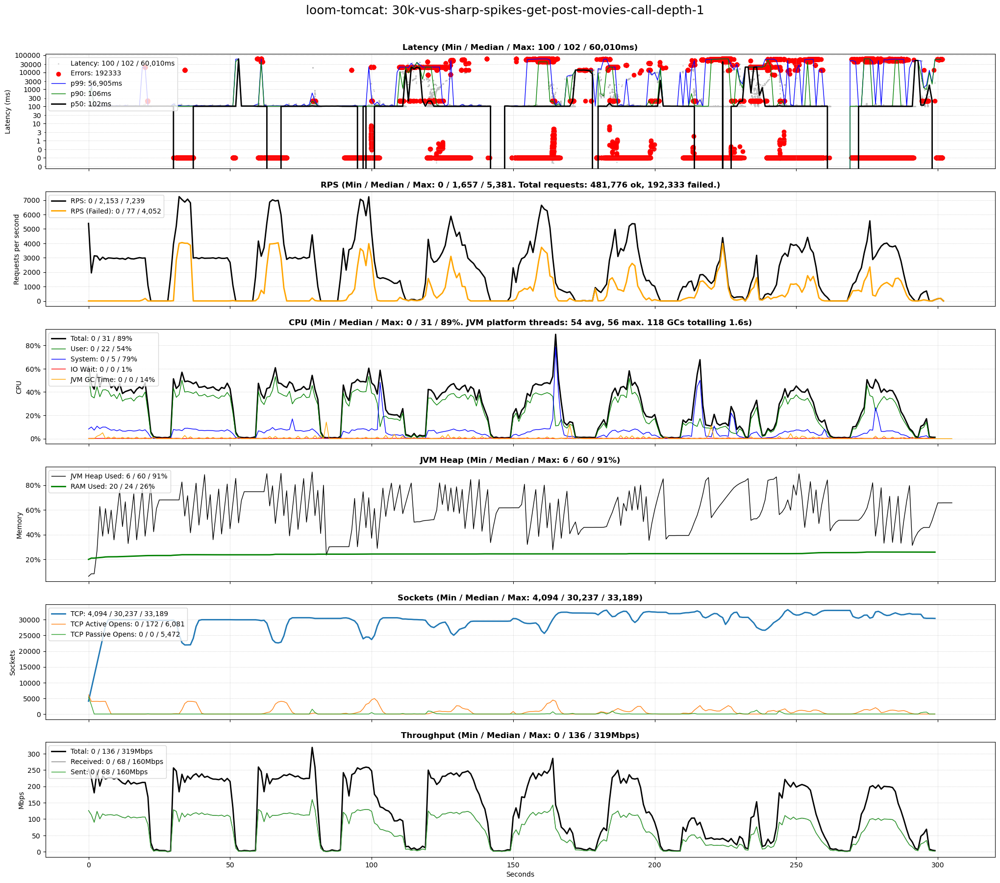

# scenarios-sharp-spikes

## Test Time

| **Name**                | **Value** |
|-------------------------|-----------|
| **Start (UTC)** | 2024-09-02 10:38:40 |
| **End (UTC)** | 2024-09-02 12:15:38 |
| **Duration (hh:mm:ss)** | 01:36:58 |

## System Specs

| **Name**                | **Value** |
|-------------------------|-----------|
| **Java** | OpenJDK 64-Bit Server VM Corretto-21.0.4.7.1 (build 21.0.4+7-LTS, mixed mode, sharing) |
| **Python** | 3.12.3 |
| **OS** | Ubuntu 24.04.1 LTS |
| **Kernel** | 6.8.0-41-generic |
| **CPU** | Intel(R) Core(TM) i7-6700K CPU @ 4.00GHz |
| **CPU Cores** | 8 |
| **RAM** | 31Gi total, 26Gi available |
| **Disk** | 506G total, 290G available |

## Scenarios

**Scenario file:** src/main/resources/scenarios/scenarios-sharp-spikes.csv

| Scenario | k6 Config | Server Profiles | Delay Call Depth | Delay (ms) | Connections | Requests per Second | Warmup Duration (s) | Test Duration (s) |
|----------|-----------|-----------------|------------------|------------|-------------|---------------------|---------------------|------------------|
| [10k-vus-sharp-spikes-get-post-movies-call-depth-0](#10k-vus-sharp-spikes-get-post-movies-call-depth-0) | get-post-movies-sharp-vus-spikes.js |  | 0 | 100 | 10000 |  | 0 | 300 |
| [10k-vus-sharp-spikes-get-post-movies-call-depth-1](#10k-vus-sharp-spikes-get-post-movies-call-depth-1) | get-post-movies-sharp-vus-spikes.js |  | 1 | 100 | 10000 |  | 0 | 300 |
| [20k-vus-sharp-spikes-get-post-movies-call-depth-0](#20k-vus-sharp-spikes-get-post-movies-call-depth-0) | get-post-movies-sharp-vus-spikes.js |  | 0 | 100 | 20000 |  | 0 | 300 |
| [20k-vus-sharp-spikes-get-post-movies-call-depth-1](#20k-vus-sharp-spikes-get-post-movies-call-depth-1) | get-post-movies-sharp-vus-spikes.js |  | 1 | 100 | 20000 |  | 0 | 300 |
| [30k-vus-sharp-spikes-get-post-movies-call-depth-0](#30k-vus-sharp-spikes-get-post-movies-call-depth-0) | get-post-movies-sharp-vus-spikes.js |  | 0 | 100 | 30000 |  | 0 | 300 |
| [30k-vus-sharp-spikes-get-post-movies-call-depth-1](#30k-vus-sharp-spikes-get-post-movies-call-depth-1) | get-post-movies-sharp-vus-spikes.js |  | 1 | 100 | 30000 |  | 0 | 300 |

## Result Overview

### Overall

### Netty-based

## Result Details

### 10k-vus-sharp-spikes-get-post-movies-call-depth-0

#### loom-tomcat

#### loom-netty

#### webflux-netty

### 10k-vus-sharp-spikes-get-post-movies-call-depth-1

#### loom-tomcat

#### loom-netty

#### webflux-netty

### 20k-vus-sharp-spikes-get-post-movies-call-depth-0

#### loom-tomcat

#### loom-netty

#### webflux-netty

### 20k-vus-sharp-spikes-get-post-movies-call-depth-1

#### loom-tomcat

#### loom-netty

#### webflux-netty

### 30k-vus-sharp-spikes-get-post-movies-call-depth-0

#### loom-tomcat

#### loom-netty

#### webflux-netty

### 30k-vus-sharp-spikes-get-post-movies-call-depth-1

#### loom-tomcat

#### loom-netty

#### webflux-netty

