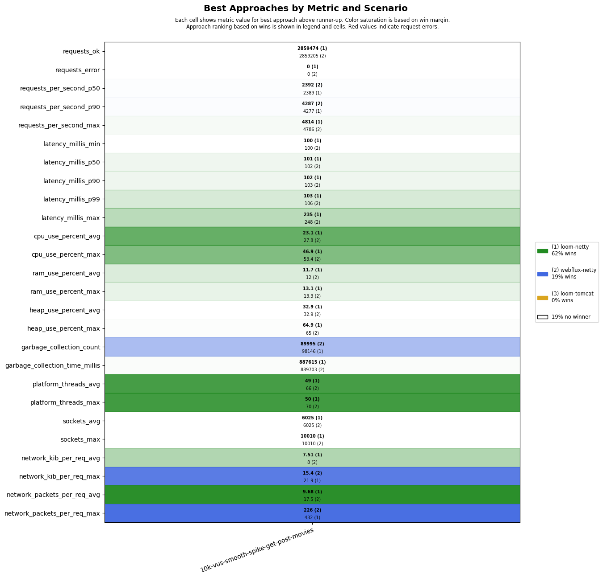
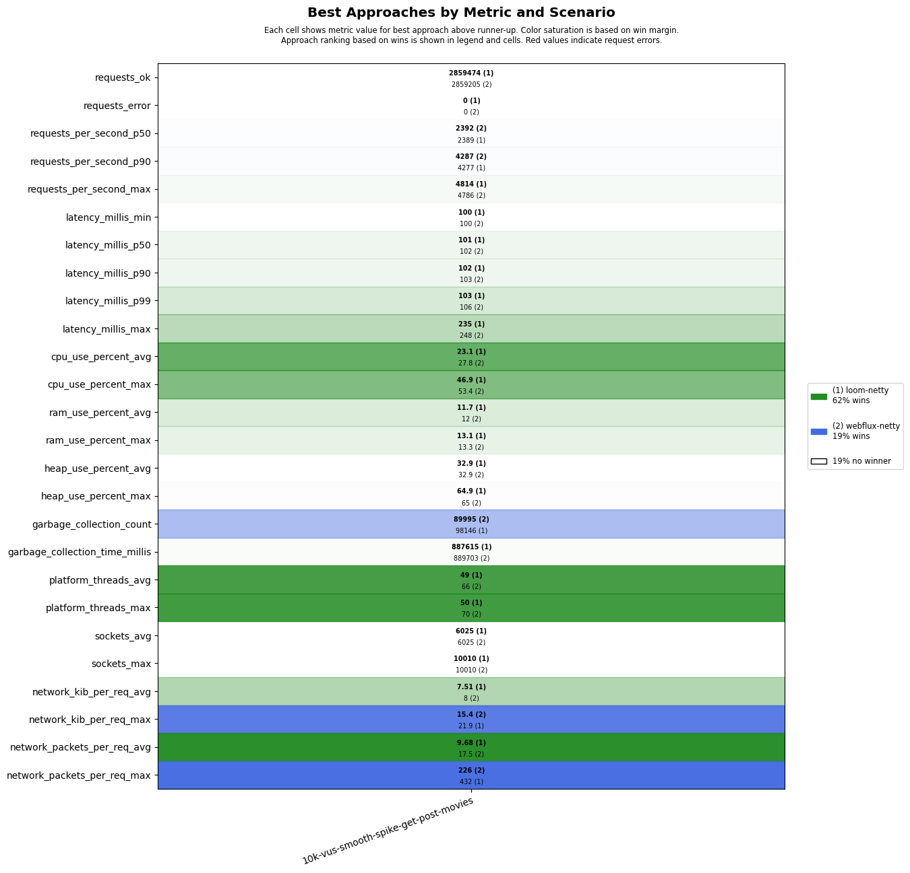
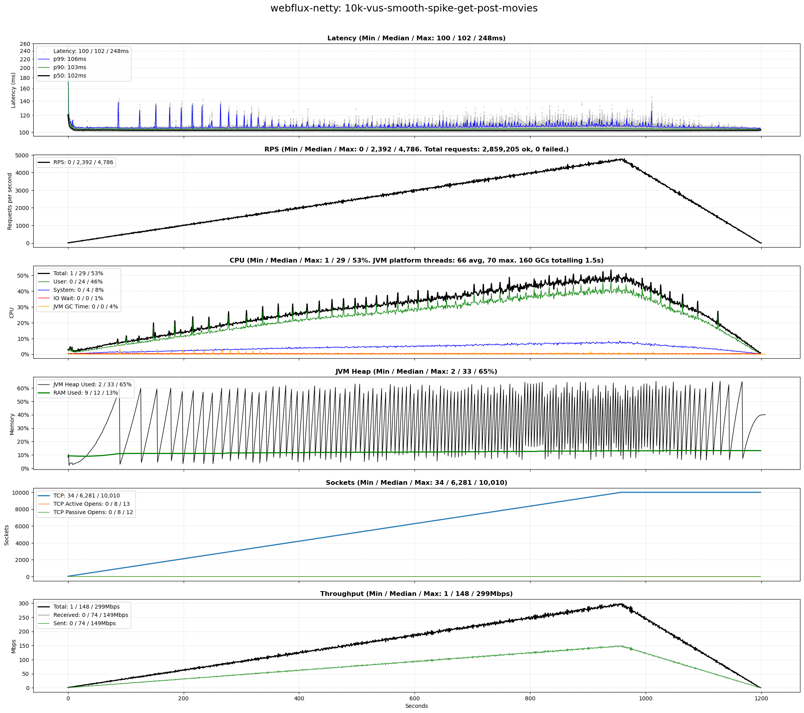

# scenarios-soaktest

## Test Time

| **Name**                | **Value** |
|-------------------------|-----------|
| **Start (UTC)** | 2025-06-21 17:41:40 |
| **End (UTC)** | 2025-06-21 18:42:41 |
| **Duration (hh:mm:ss)** | 01:01:01 |

## System Specs

| **Name**                | **Value** |
|-------------------------|-----------|
| **Java** | OpenJDK 64-Bit Server VM Corretto-21.0.7.6.1 (build 21.0.7+6-LTS, mixed mode, sharing) |
| **Spring Boot** | 3.5.3 |
| **Python** | 3.12.3 |
| **OS** | Ubuntu 24.04.2 LTS |
| **Kernel** | 6.11.0-26-generic |
| **CPU** | Intel(R) Core(TM) i5-14600K |
| **CPU Cores** | 20 |
| **RAM** | 62Gi total, 53Gi available |
| **Disk** | 1023G total, 610G available |

## Scenarios

**Scenario file:** src/main/resources/scenarios/scenarios-soaktest.csv

| Scenario | k6 Config | Server Profiles | Delay Call Depth | Delay (ms) | Connections | Requests per Second | Warmup Duration (s) | Test Duration (s) |
|----------|-----------|-----------------|------------------|------------|-------------|---------------------|---------------------|------------------|
| [10k-vus-smooth-spike-get-post-movies](#10k-vus-smooth-spike-get-post-movies) | get-post-movies-smooth-vus-spike.js |  | 0 | 100 | 10000 |  | 0 | 1200 |

## Result Overview

### Overall

### Netty-based

## Result Details

### 10k-vus-smooth-spike-get-post-movies

#### loom-tomcat

#### loom-netty

#### webflux-netty

